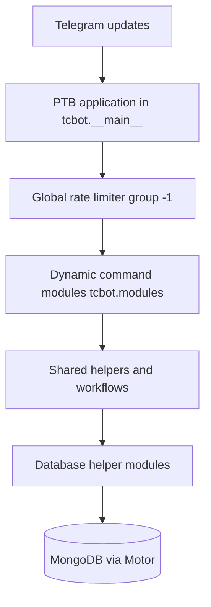

# TCF Bot

TCF Bot is a Telegram federation management bot for the Transsion Core Federation community. It coordinates moderation across connected groups, records audit trails, supports appeal review, and exposes a small Flask health-check endpoint for hosted environments.

## Features

- **Federation bans**: create, update, and lift bans across all connected groups.
- **Ban proof workflow**: collect proof media/text before enforcement and store proof message references.
- **Appeals**: deep-link private-message flow with staff review buttons and appeal records.
- **Connected groups**: approve group joins, track active groups, and run multi-group actions safely.
- **Staff roles**: Founder, Admin, Developer, and Tester hierarchy with promotion/demotion workflows.
- **Moderation actions**: ban, unban, kick, mute, warn, warning reset, checks, stats, and broadcast helpers.
- **Smart mentions**: every user reference includes a clickable `tg://user?id=...` link. With username: `Name | @username (tg://user?id=ID)`. Without username: `Name (tg://user?id=ID)`. Works in welcome messages, ban/kick/mute/warn logs, check profiles, and all action summaries.
- **Flexible target resolution**: reply-first priority with partial name search support for natural command usage.
- **Audit logging**: moderation, appeal, role, and error reports to configured log destinations.
- **Health checks**: Flask keep-alive server on `PORT` with `GET /` returning `OK` and `GET /health` returning a JSON subsystem-status report.

## Stack

| Component | Current project setting |
|---|---|
| Python | 3.14 project target (`requires-python = ">=3.13"`) |
| Bot framework | `python-telegram-bot[rate-limiter]` (no `[job-queue]` extra), tracking the latest compatible release |
| Database | MongoDB through Motor (latest) |
| Health server | Flask (latest) |
| Configuration | Environment variables, with `python-dotenv` loading local `config.env` |
| Dependency manager | `uv` with `uv.lock` |
| Formatting/linting | Ruff |

## Quick Start

### 1. Install dependencies

```bash
uv sync --frozen
```

### 2. Configure environment

For local development, copy the template and fill in your own values:

```bash
cp config.env.example config.env
```

Never commit real credentials. At minimum, the bot needs:

- `BOT_TOKEN`: Telegram bot token from BotFather.
- `MONGODB_URI`: MongoDB connection string.
- `OWNER_ID`: Telegram user ID for the initial federation founder.

See [Configuration](#configuration) below and `config.env.example` for the complete list. For detailed setup instructions, see [`docs/getting-started/setup.md`](docs/getting-started/setup.md). For Replit-specific setup, see [`replit.md`](replit.md).

### 3. Run the bot

```bash
python -m tcbot
```

## Docker Compose

```bash
docker-compose up --build
```

The compose setup starts the bot plus local `mongo:7` and `redis:7-alpine` services. The bot reads `.env` (copy from `config.env.example`) and waits for both dependencies to pass health checks.

See [`docs/getting-started/setup.md`](docs/getting-started/setup.md) for detailed Docker setup instructions.

## Replit / Hosted Deployment

Use Replit Secrets or the hosting platform's secret manager for credentials. Do not store tokens or MongoDB URIs in committed files.

Recommended run command:

```bash
python -m tcbot
```

The Flask keep-alive server binds to `0.0.0.0:${PORT}`. If `PORT` is unset, invalid, or outside `1..65535`, the application defaults to `5000`.

See [`replit.md`](replit.md) for Replit-specific setup notes and deployment checklist.

## Vercel (Serverless)

Native serverless deployment via `api/webhook.py` (Telegram updates) and `api/cron.py` (daily warn expiry), configured in `vercel.json`. Requires explicit `WEBHOOK_SECRET` and `CRON_SECRET`; dependencies install from `pyproject.toml` + `uv.lock` and Python `3.14` comes from `.python-version`.

See [`docs/operations/vercel.md`](docs/operations/vercel.md) for setup, `setWebhook` registration, and serverless limitations (multi-step conversations are best-effort without instance affinity).

## Configuration

Configuration is loaded from environment variables in `tcbot/__init__.py`. For local development, `python-dotenv` reads `config.env` if it exists. Startup fails fast when required runtime values such as `BOT_TOKEN`, `MONGODB_URI`, or `OWNER_ID` are missing.

For detailed environment variable formats and validation, see [`docs/getting-started/setup.md`](docs/getting-started/setup.md). For Replit-specific deployment, see [`replit.md`](replit.md).

| Variable | Required | Description |
|---|---:|---|
| `BOT_TOKEN` | Yes | Telegram bot token from BotFather. |
| `OWNER_ID` | Yes | Positive Telegram user ID seeded as the initial Founder. |
| `MONGODB_URI` | Yes | MongoDB connection string. |
| `REDIS_URL` | No | Redis connection URL (e.g. `redis://localhost:6379/0`). Enables L2 distributed cache and Redis-backed rate limiting. Falls back to in-process rate limiting when absent. |
| `WEBHOOK_URL` | Usually | Public HTTPS URL for Telegram webhook (e.g. `https://your-domain.com`). Required for webhook mode; omit only for local development (falls back to polling). |
| `WEBHOOK_SECRET` | No | Secret token passed to `set_webhook` and validated on every incoming update (`X-Telegram-Bot-Api-Secret-Token` header). When omitted, the bot generates a random token at startup. **Required on Vercel** (serverless instances cannot re-register per cold start). |
| `CRON_SECRET` | No | Bearer token protecting the Vercel cron endpoint (`/api/cron`). Leave empty only for local testing; always set it in production. |
| `DB_NAME` | No | MongoDB database name, default `tcbot`. |
| `COMMUNITY_NAME` | No | Display name used in bot messages and logs. |
| `PREFIXES` | No | Python-style list of command prefixes, default `["/", "!", "."]`. |
| `PORT` | No | Flask keep-alive port, default `5000`; invalid or out-of-range values fall back to `5000`. |
| `MAIN_GROUP` | Usually | Main community group/forum chat ID. Required for appeal review cards and promotion-flow messages. |
| `MAIN_CHANNEL` | No | Main announcement channel chat ID. |
| `EXTEND_GROUP` | No | Optional secondary/staff group watched by selected handlers. |
| `PROOFS` | Usually | Proof destination as `chat_id` or `chat_id/thread_id`. |
| `LOGS` | Usually | Action log destination as `chat_id` or `chat_id/thread_id`. |
| `LOGS_ERRORS` | No | Error log destination; if empty, error logs are suppressed. |
| `APPEALS` | Usually | Appeal record destination as `chat_id` or `chat_id/thread_id`. |
| `APPEAL_LOG_HANDLE` | No | Public log handle shown in appeal instructions. |
| `APPEAL_DISCUSSION_TOPIC` | Usually | Thread ID inside `MAIN_GROUP` for appeal review cards. |
| `WARN_LIMIT` | No | Warn count that triggers an automatic federation ban, default `3`, minimum `1`. |
| `FED_WARN_LIMIT` | No | Federation-wide warn threshold (across all groups), default `0` (disabled). |
| `WARN_EXPIRY_DAYS` | No | Days after which warn counts expire and are deleted, default `0` (disabled). |
| `PROOF_TIMEOUT_SECONDS` | No | Parsed and stored in `cfg.proof_timeout`; **not currently enforced** (PTB `conversation_timeout` is not wired because the `[job-queue]` extra conflicts with this project's APScheduler setup). Conversations end via the command-fallback handler or the Cancel button. Default `100`; values below `1` fall back to default. |
| `APPEAL_TIMEOUT_SECONDS` | No | Parsed and stored in `cfg.appeal_timeout`; **not currently enforced** (same reason as `PROOF_TIMEOUT_SECONDS`). Default `600`; values below `1` fall back to default. |
| `ALBUM_DEBOUNCE_SECONDS` | No | Album media grouping window, default `2`; values below `1` fall back to default. |
| `LOG_LEVEL` | No | Logging level, default `INFO`. |
| `MODULES_LOAD` | No | Comma-separated module allowlist. |
| `MODULES_NO_LOAD` | No | Comma-separated module denylist. |

Destination variables such as `LOGS`, `PROOFS`, and `APPEALS` accept either a chat ID (`-1001234567890`) or a forum topic pair (`-1001234567890/42`).

## Architecture Summary



Key runtime pieces:

- `tcbot/__init__.py` loads environment configuration into an immutable dataclass and exposes the `cfg` adapter.
- `tcbot/__main__.py` starts logging, launches Flask keep-alive, builds the PTB application, registers handlers, connects MongoDB in `post_init`, and starts webhook transport when a public URL is available. Local development without a public URL falls back to polling.
- `tcbot/modules/__init__.py` discovers top-level modules, collects their `__handlers__` lists, and fails startup if an enabled module cannot be imported.
- `tcbot/database/mongos.py` owns the Motor client, database accessor, short ID generator, and index setup.
- `tcbot/utils/dispatch.py` provides bounded concurrent fan-out for multi-group Telegram API calls.
- `tcbot/utils/error_reporter.py` receives handler, asyncio, and logging errors for reporting to the configured error destination.

For detailed architecture, see [`docs/architecture/repository-map.md`](docs/architecture/repository-map.md). For module breakdown, see [`docs/architecture/modules.md`](docs/architecture/modules.md). For database details, see [`docs/architecture/database.md`](docs/architecture/database.md).

## Repository Layout

```text
<project root>/
├── tcbot/                    Bot package
│   ├── database/             Async MongoDB helper modules
│   ├── modules/              Command modules and Telegram handlers
│   │   └── helper/           Formatters, decorators, keyboards, workflows
│   │       └── workflows/    Conversation flows (`*_flow.py`)
│   └── utils/                Logging, prefixes, dispatch, datetime helpers
├── api/                      Vercel serverless endpoints (webhook, cron)
├── docs/                     Developer documentation grouped by category
├── .agents/                  Repository maintenance guidance and skills
├── config.env.example        Environment template
├── docker-compose.yml        Bot + MongoDB local compose setup
├── vercel.json               Vercel functions, timeouts, and cron schedule
├── .python-version           Pinned Python for Vercel and uv (3.14)
├── pyproject.toml            Project metadata, dependencies, Ruff
├── uv.lock                   Locked dependency graph
├── CONTRIBUTING.md           Contribution workflow and review checklist
├── AGENTS.md                 Project guide for contributors
└── replit.md                 Replit deployment notes
```

## Code Quality

```bash
ruff format .
ruff check --fix .
pyright tcbot/
```

Ruff targets Python 3.14 and line length 88. GitHub Actions install dependencies through `uv sync --frozen` so CI follows `pyproject.toml` and `uv.lock`. Project code should follow the detailed rules in [tooling and validation](.agents/rules/tooling-validation.md), [code style and architecture](.agents/rules/code-style.md), and [comment and documentation style](.agents/rules/comment-style.md).

## CI/CD & Automation

The project uses **5 automated GitHub Actions workflows** for continuous integration, code quality, and maintenance:

### Lint
**File:** `.github/workflows/lint.yml`

CI check that reports whether the following validations pass:
- Runs on push to `main`, `feat/**`, `fix/**` branches and on all PRs to `main`
- Runs `ruff format --check .` (format check), `ruff check .` (lint), and `python -c "import tcbot"` (import check)
- The workflow run fails if any step has an error. Branch protection can use
  this result as a merge requirement.

### Auto-Fix Code Quality
**File:** `.github/workflows/auto-fix.yml`

Automatically fixes code style and linting issues with Ruff:
- Runs on push to `main`, `feat/**`, `fix/**` branches
- Runs on pull requests and weekly (Monday 04:00 UTC)
- **Creates or updates an auto-fix PR** for review when fixes are found outside
  a pull-request run
- Does not commit fixes directly to `main`
- Reduces manual work for code style

### Dependency Updates (Like Dependabot)
**File:** `.github/workflows/dependency-update.yml`

Weekly automated dependency updates:
- Runs every Monday 04:00 UTC
- Executes `uv lock --upgrade` to update all dependencies
- **Creates a PR** with the updated lockfile
- Sends **Telegram status notifications** when configured
- Reduces manual work for routine updates

### Other Workflows
- **CodeQL** (`.github/workflows/codeql.yml`) - Security analysis
- **Run Bot** (`.github/workflows/run-bot.yml`) - Long-running runner. Each
  run stays active for a ~5 hour window (GitHub caps a job at 6h), attempts to
  dispatch its successor ~10 minutes before the window ends, and has an
  every-15-minute cron fallback. A concurrency group prevents overlapping runs.

### Full Documentation
For detailed workflow descriptions, trigger conditions, notification format examples, troubleshooting, and best practices, see [`docs/operations/ci-cd.md`](docs/operations/ci-cd.md). For changelog of all CI/CD additions, see [`CHANGELOG.md`](CHANGELOG.md).

### Required Secrets
Configure in GitHub repository settings → Secrets:
- `BOT_TOKEN` - Telegram bot token (bot runtime and notifications)
- `MONGODB_URI` - MongoDB connection string for the bot runtime
- `OWNER_ID` - Your Telegram user ID (initial owner and notifications)
- `BOT_PAT` - Optional Personal Access Token with the `workflow` scope, used by Run Bot to self-chain into the next run for seamless 24/7 coverage
- `GITHUB_TOKEN` - Auto-provided by GitHub Actions

## Where to look next

- For project guide and contributor rules, see [`AGENTS.md`](AGENTS.md).
- For the contribution workflow and pull request checklist, see [`CONTRIBUTING.md`](CONTRIBUTING.md).
- For Replit deployment notes, see [`replit.md`](replit.md).
- For developer documentation overview and detailed guide index, see [`docs/README.md`](docs/README.md).
- For local, Docker, and hosted setup workflow, see [`docs/getting-started/setup.md`](docs/getting-started/setup.md).
- For module boundaries and command ownership, see [`docs/architecture/modules.md`](docs/architecture/modules.md).
- For database layer notes and indexes, see [`docs/architecture/database.md`](docs/architecture/database.md).
- For shared helper documentation, see [`docs/architecture/helpers.md`](docs/architecture/helpers.md).
- For utility module notes, see [`docs/architecture/utilities.md`](docs/architecture/utilities.md).
- For user-facing flow overview, see [`docs/features/workflow-overview.md`](docs/features/workflow-overview.md). For conversation internals, see [`docs/architecture/workflows.md`](docs/architecture/workflows.md).
- For appeals flow, see [`docs/features/appeals.md`](docs/features/appeals.md). For banning flow, see [`docs/features/moderation/banning.md`](docs/features/moderation/banning.md). For roles, see [`docs/features/roles/roles.md`](docs/features/roles/roles.md). For warnings, see [`docs/features/moderation/warnings.md`](docs/features/moderation/warnings.md).
- For detailed engineering rules used by repository maintainers, see [tooling and validation](.agents/rules/tooling-validation.md), [code style and architecture](.agents/rules/code-style.md), and [comment and documentation style](.agents/rules/comment-style.md).

## Current Status

- Runtime entry point: `python -m tcbot`.
- Dependency management: `uv` and `uv.lock`.
- Database: MongoDB/Motor with startup index creation.
- Health check: Flask `GET /` endpoint on `PORT`.
- Secrets policy: use environment variables; never commit real tokens, MongoDB URIs, or private chat IDs.

## License

Copyright © 2024-2026 Transsion Core, Dizzy, Ave Studio. All rights reserved.

See `LICENSE` for details.
