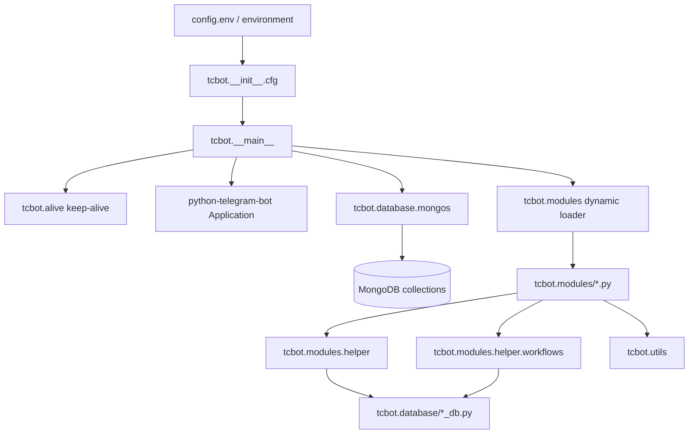

# TCF Bot Documentation

This directory contains the maintained documentation for TCF Bot, a Python
Telegram bot for Transsion Core Federation community moderation. It is written
for people who run, use, maintain, or contribute to the project.

Use this page as the documentation index. Documents are grouped by purpose so
setup instructions, architecture notes, feature behavior, operations, and
stable reference material remain easy to find.

For the project overview, see [`../README.md`](../README.md). For Replit
deployment, see [`../replit.md`](../replit.md). For contribution workflow, see
[`../CONTRIBUTING.md`](../CONTRIBUTING.md).

## Contributor reference

| Document | Purpose |
|---|---|
| [Contribution guide](../CONTRIBUTING.md) | Local setup, development workflow, validation, pull requests, and security checklist. |

## Documentation map

### Getting started

| Document | Purpose |
|---|---|
| [Setup guide](getting-started/setup.md) | Local, Docker, and hosted setup, environment variables, and validation commands. |

### Architecture

| Document | Purpose |
|---|---|
| [Repository map](architecture/repository-map.md) | Repository structure, package ownership, startup flow, and service boundaries. |
| [Modules](architecture/modules.md) | Command modules, dynamic discovery, handler registration, and command ownership. |
| [Database layer](architecture/database.md) | MongoDB collections, helper modules, indexes, document shapes, and cache rules. |
| [Helper package](architecture/helpers.md) | Formatting, decorators, target extraction, keyboards, role guards, and log builders. |
| [Runtime utilities](architecture/utilities.md) | Circuit breaker, dispatch, prefixes, logging, error reporting, and datetime utilities. |
| [Workflow internals](architecture/workflows.md) | Conversation factories, state constants, callback patterns, and flow internals. |

### Features

| Document | Purpose |
|---|---|
| [Workflow overview](features/workflow-overview.md) | User-visible moderation, appeal, connection, role, statistics, and maintenance flows. |
| [Appeals](features/appeals.md) | Appeal deep links, private DM submission, review actions, and edge cases. |
| [Statistics](features/statistics.md) | `/tcstats`, drill-down views, search, and asynchronous design. |
| [Banning](features/moderation/banning.md) | Federation ban flow, proof collection, updates, unban checks, logs, and appeal links. |
| [Kicking](features/moderation/kicking.md) | `/tckick` group kick flow, auto-demote before kick, reason/proof conversation, and audit log. |
| [Muting](features/moderation/muting.md) | Federation-wide mute, optional duration tokens, unmute, replay on group connect, and edge cases. |
| [Unbanning](features/moderation/unbanning.md) | `/tcunban` deactivation flow, parallel pre-fetch, scheduler cancel, and edge cases. |
| [Check](features/moderation/check.md) | `/check`, profile drill-downs, pagination, parallel reads, and edge cases. |
| [Warnings](features/moderation/warnings.md) | Per-group warnings, proof handling, automatic bans, and warning storage. |
| [Connecting](features/moderation/connecting.md) | `/tcconnect` and bot-added prompt, complete_join behavior, ban/mute replay, and edge cases. |
| [Disconnecting](features/moderation/disconnecting.md) | `/tcdisconnect` and `/rmtc` group disconnect, parallel deactivation, and edge cases. |
| [Groups](features/moderation/groups.md) | `/tcgroups` connected-groups list, keyboard navigation, and edge cases. |
| [Roles](features/roles/roles.md) | Founder, Admin, Developer, and Tester hierarchy and safety rules. |
| [Promote](features/roles/promote.md) | `/tcpromote`, direct and request-based promotion, callbacks, and edge cases. |
| [Demote](features/roles/demote.md) | `/tcdemote`, automatic demotion, permission rules, and audit logging. |

### Operations

| Document | Purpose |
|---|---|
| [Backup and restore](operations/backup-and-restore.md) | MongoDB backup, restore, post-restore checks, and security notes. |
| [CI/CD workflows](operations/ci-cd.md) | GitHub Actions triggers, required secrets, notifications, and troubleshooting. |
| [Performance](operations/performance.md) | Batch query patterns, cache and concurrency guidance, and measurement practices. |
| [Vercel deployment](operations/vercel.md) | Native serverless deployment: webhook + cron endpoints, setup, and serverless limitations. |

### Reference

| Document | Purpose |
|---|---|
| [Keyboard styles](reference/keyboard-styles.md) | Inline keyboard layouts and callback-data naming conventions. |

## Architecture at a glance



Runtime starts with `python -m tcbot`. The entry point loads configuration, starts the Flask health endpoint, builds the Telegram application, connects MongoDB, ensures indexes, seeds the initial owner, dynamically loads handlers, and starts webhook transport when `WEBHOOK_URL` or `REPLIT_DEV_DOMAIN` is available. Local development without a public URL falls back to polling.

## Core rules

- Keep command handlers in `tcbot/modules/`.
- Keep shared handler helpers in `tcbot/modules/helper/`.
- Keep conversation factories in `tcbot/modules/helper/workflows/*_flow.py`.
- Keep MongoDB reads and writes behind `tcbot/database/*_db.py` helpers.
- Keep runtime utilities in `tcbot/utils/`.
- Use HTML parse mode for bot messages and escape user-provided text through formatter helpers.
- Keep bot tokens, MongoDB URIs, private chat IDs, passwords, and API keys out
  of the repository.

## Development commands

```bash
uv sync --frozen
ruff format .
ruff check --fix .
python -m tcbot
pyright tcbot/
```

On systems where `python3` is preferred, replace `python` with `python3`.
