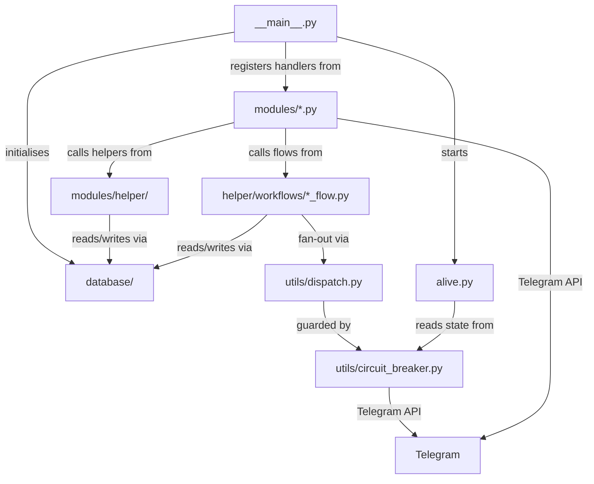
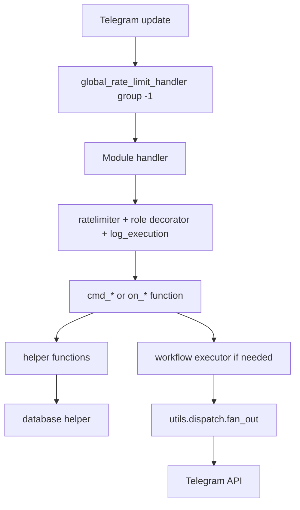

# Repository Map

For the project overview, see [`../../README.md`](../../README.md). For the
documentation index, see [`../README.md`](../README.md). For module breakdown,
see [`modules.md`](modules.md). For the database layer, see
[`database.md`](database.md). For shared helpers, see [`helpers.md`](helpers.md).
For runtime utilities, see [`utilities.md`](utilities.md). For contribution
workflow, see [`../../CONTRIBUTING.md`](../../CONTRIBUTING.md).

This page maps the repository structure and the service boundaries between packages.

## Top-level layout

```text
<project root>/
├── tcbot/                  Main Python package
├── api/                    Vercel serverless endpoints (webhook, cron)
├── docs/                   Documentation grouped by purpose
├── pyproject.toml          Dependencies and Ruff config
├── uv.lock                 Locked dependency graph
├── vercel.json             Vercel functions, timeouts, and cron schedule
├── .python-version         Pinned Python for Vercel and uv (3.14)
├── config.env.example      Environment variable template
├── README.md               Project overview
├── CONTRIBUTING.md         Contribution workflow and review checklist
├── AGENTS.md               Maintainer and agent project guide
├── replit.md               Replit deployment notes
├── CHANGELOG.md            Version history
├── docker-compose.yml      Bot + MongoDB + Redis local stack
└── Dockerfile              Container image
```

Repository maintenance guidance lives under `.agents/`. Its six canonical
rule files are `rules/tooling-validation.md`, `rules/code-style.md`,
`rules/comment-style.md`, `rules/docs-rules.md`, `rules/security-rules.md`, and
`rules/asyncio-gather-rules.md`; specialized skills live under `.agents/skills/`.

## Documentation structure

| Category | Scope |
|---|---|
| `getting-started/` | Local, Docker, and hosted setup instructions. |
| `architecture/` | Repository boundaries, modules, database, helpers, utilities, and workflow internals. |
| `features/` | User-visible flows and detailed moderation, role, appeal, and statistics behavior. |
| `operations/` | Backup and restore, CI/CD, and performance guidance. |
| `reference/` | Stable UI and callback conventions such as keyboard styles. |

## Runtime package map

```text
tcbot/
├── __init__.py             Environment loader and cfg adapter
├── __main__.py             PTB app setup, DB init, handler registration, webhook (polling fallback in local dev)
├── alive.py                Flask health endpoint and webhook receiver
├── serverless.py           Vercel lifecycle: shared PTB app, update dispatch, cron expiry
├── database/
│   ├── mongos.py           Motor client, collection accessor, indexes
│   ├── bans_db.py          Federation ban records (incl. per-user history)
│   ├── groups_db.py        Connected groups and pending joins
│   ├── users_cache.py      Member profile cache operations
│   ├── users_roles.py      Owners/admins + dev/tester roles, effective-role resolution
│   ├── warns_db.py         Warnings and warning counters (incl. per-user aggregates)
│   ├── kicks_db.py         Kick audit records (incl. per-user history)
│   ├── mutes_db.py         Mute audit records (incl. per-user history)
│   ├── queues_db.py        Promotion request queue
│   ├── cache.py            L1 TTL caches with optional Redis L2
│   ├── redis_client.py     Optional async Redis client
│   ├── scheduler.py        APScheduler background jobs with MongoDB store
│   ├── documents.py        TypedDict document shapes
│   └── types.py            NewType ID primitives
├── modules/
│   ├── __init__.py         Dynamic module discovery and handler collection
│   ├── *.py                Command and callback modules
│   └── helper/
│       ├── decorators.py   Auth, per-handler rate limits, tracing, resolve_and_check
│       ├── extraction.py   Target resolution
│       ├── formatter.py    HTML escaping and formatting
│       ├── keyboards.py    Inline keyboard factories
│       ├── ban_info.py     Ban detail renderer
│       ├── identity.py     Identity classification, refusal messages, staff notices
│       ├── replies.py      Shared reply string constants (errors, permissions, syntax)
│       ├── parse_*.py      Link, log, and safe-edit helpers
│       └── workflows/
│           └── *_flow.py   Conversation factories, plus Promote / Demote / Check classes
└── utils/
    ├── circuit_breaker.py  Async circuit breaker for Telegram + MongoDB
    ├── dispatch.py         Bounded concurrent fan-out (integrates Telegram circuit)
    ├── error_reporter.py   Telegram error classification and reporting
    ├── formatter.py        HTML escaping and formatting (single source of truth)
    ├── logger.py           Console formatter and error log handler
    ├── pagination.py       Shared paginate(), nav_row(), date_or_unknown() helpers
    ├── prefixes.py         Prefix parsing and command filters
    └── time_and_date.py    Central clock: UTC storage/display + monotonic measure
```

## Ownership boundaries

| Area | Owns | Must not own |
|---|---|---|
| `tcbot/__main__.py` | Application startup, global handlers, DB init, webhook transport (polling fallback for local dev only) | Feature business logic |
| `tcbot/modules/*.py` | Command entry points, handler registration, user-facing permissions | Raw MongoDB writes, duplicate conversation state handlers |
| `tcbot/modules/helper/` | Shared handler helpers and keyboard factories | Top-level command registration |
| `tcbot/modules/helper/workflows/*_flow.py` | Conversation factories, state transitions, flow executors | Module discovery or `__handlers__` exports |
| `tcbot/database/*_db.py` | Collection-specific DB operations | Telegram API calls |
| `tcbot/utils/` | Runtime infrastructure utilities | Feature-specific moderation policy |



## Startup flow

```mermaid
sequenceDiagram
    participant Proc as uv run python -m tcbot
    participant Config as tcbot.__init__
    participant Main as tcbot.__main__
    participant Alive as tcbot.alive
    participant DB as database.mongos
    participant Mods as tcbot.modules
    participant PTB as PTB Application

    Proc->>Config: load env into cfg
    Proc->>Main: call main()
    Main->>Main: setup logging
    Main->>Alive: start Flask health thread
    Main->>PTB: build Application (post_init registered as callback)
    Main->>Mods: get_handlers()
    Mods->>Mods: discover, filter, import modules
    Mods-->>Main: handlers
    Main->>PTB: add handlers and error handler
    Main->>PTB: initialize() + post_init (explicit; not called by PTB in webhook mode)
    Main->>DB: connect() and ensure_indexes()
    Main->>DB: ensure_initial_owner()
    Main->>Main: connect Redis (optional)
    Main->>Main: start APScheduler
    Main->>Main: attach error_reporter + asyncio handler
    Main->>PTB: set_webhook() + get_webhook_info() verify
    Main->>Alive: register_webhook() wire Flask /webhook -> PTB queue
    PTB->>PTB: await updates from Flask webhook receiver
```

## Dynamic module discovery

`tcbot/modules/__init__.py` discovers every top-level `tcbot/modules/*.py` file except `__init__.py`.

Filtering order:

1. If `MODULES_LOAD` is set, only those module names are loaded. Invalid names cause startup to exit.
2. If `MODULES_NO_LOAD` is set, matching names are removed from the discovered list.
3. `get_handlers()` imports active modules and extends the application handler list with each module's `__handlers__`.

Module names are filenames without `.py`, for example `banning`, `appeals`, or `maintenance`.

## Request handling layers



## Cross-links

- Setup and environment: [Setup guide](../getting-started/setup.md)
- Command modules: [Modules](modules.md)
- Workflows: [Workflow overview](../features/workflow-overview.md) and [Workflow internals](workflows.md)
- Database layer: [Database layer](database.md)
- Shared helpers: [Helper package](helpers.md)
- Runtime utilities: [Runtime utilities](utilities.md)
