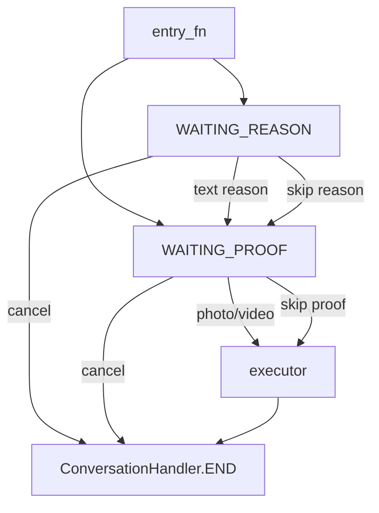
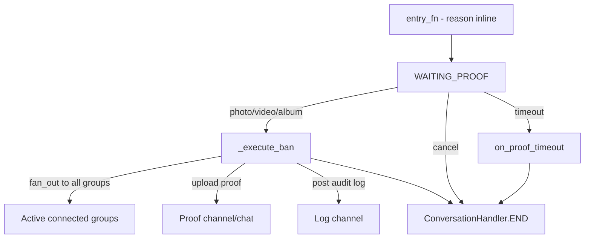
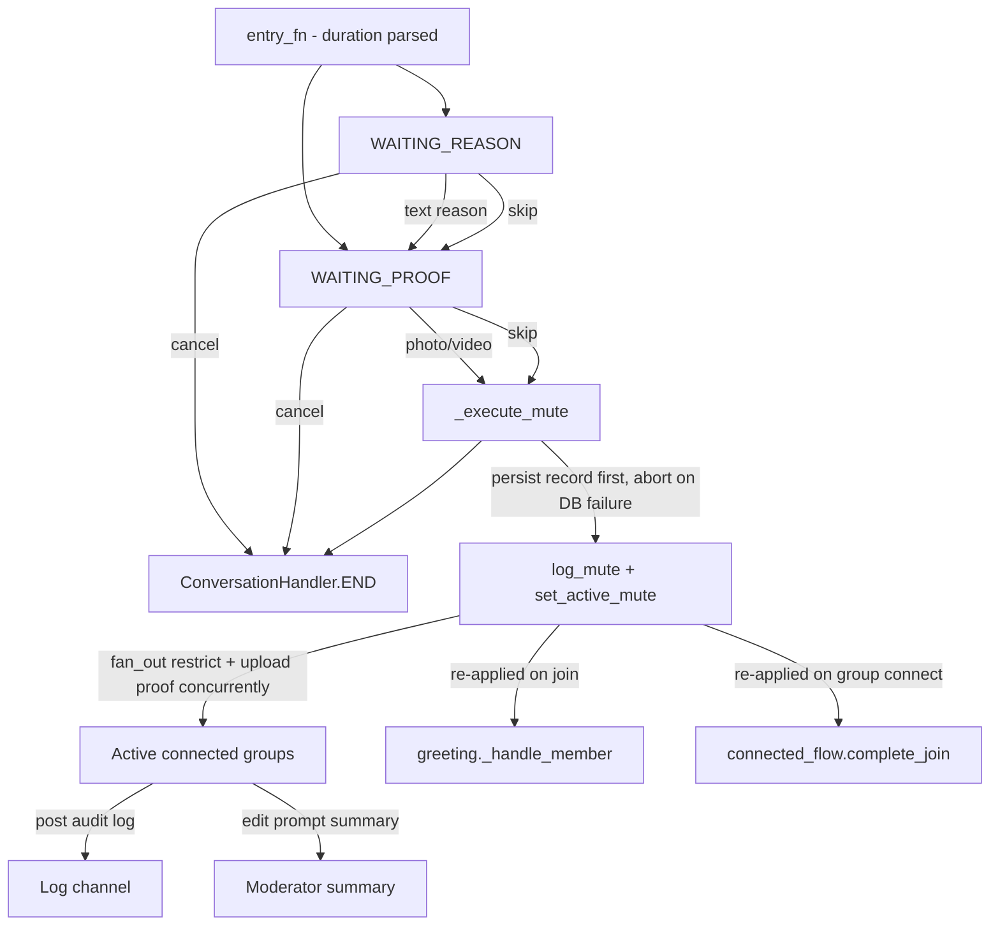
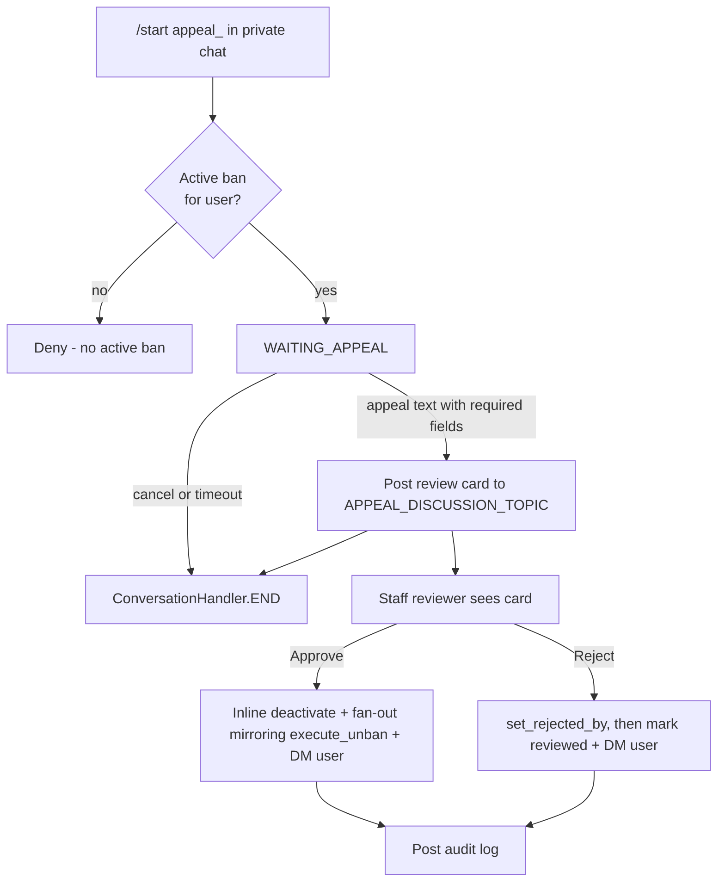

# Workflow Internals

For modules that register these conversation handlers, see [`modules.md`](modules.md).
For shared helpers, see [`helpers.md`](helpers.md). For database helpers
consumed by these flows, see [`database.md`](database.md). For per-feature flow
details, see [`../features/moderation/banning.md`](../features/moderation/banning.md),
[`../features/moderation/warnings.md`](../features/moderation/warnings.md),
[`../features/appeals.md`](../features/appeals.md),
[`../features/roles/promote.md`](../features/roles/promote.md), and
[`../features/roles/demote.md`](../features/roles/demote.md).

Conversation and multi-step logic lives in `tcbot/modules/helper/workflows/`. New conversation files must be named `*_flow.py`; do not create `*_conv.py` files.

## Package rules

- Command modules own command filters and `__handlers__` registration.
- Workflow files own state constants, `ConversationHandler` factories, and execution adapters.
- Shared reason/proof logic belongs in `reason_flow.py` and `proof_flow.py`.
- Callback handlers must call `await q.answer()` before doing further work.
- Timeout configuration values (`cfg.proof_timeout`, `cfg.appeal_timeout`, `cfg.album_debounce`) are parsed from the environment. The bot does not use job-queue or `ConversationHandler.TIMEOUT` states; conversations end via escape commands, cancel, or explicit fallback handlers (e.g. `on_proof_timeout` in `ban_flow.py` fires when the moderator sends a command during the proof window).

## Shared proof builder: `proof_flow.py`

`BuildProof` builds proof-step keyboards and messages.

| Export | Purpose |
|---|---|
| `BuildProof(action, skip_allowed=True, skip_label="Skip", cancel_label="Cancel")` | Configures proof buttons and prompts for an action. |
| `BuildProof.keyboard()` | Returns `[Skip] [Cancel]` when skipping is allowed, otherwise `[Cancel]`. |
| `BuildProof.step_prompt(...)` | Prompt after an in-conversation reason. |
| `BuildProof.noted_prompt(...)` | Prompt when a reason was provided inline. |
| `BuildProof.record(msg)` | Returns a short proof description for photo/video messages. Kept for backward compatibility; the shared reason flow no longer stores its result because no executor reads it. |
| `upload_proof(bot, msgs, caption, proof_chat, proof_thread)` | Uploads one proof item or an album and returns the uploaded message ID. Returns `None` fast without Telegram I/O on empty input or an album with no photo/video item. |

## Shared reason factory: `reason_flow.py`

State constants:

```python
WAITING_REASON = 0
WAITING_PROOF = 1
```

Exports:

| Export | Purpose |
|---|---|
| `parse_inline_reason(args, has_explicit_target)` | Returns reason text after the target token when needed. Ban, kick, mute, and warn entries all use this parser with `extraction.has_explicit_target(msg, args)` so reply-target reasons keep leading ID-like tokens. |
| `MAX_REASON_LEN` | Maximum character length accepted for a moderation reason (1000). Typed input exceeding this stays in `WAITING_REASON` with a retry notice; overlong inline reasons fail fast at the entry with the same text via `is_reason_too_long()` and `reason_too_long_text()`. `_MAX_REASON_LEN` remains as a backward-compatible alias. |
| `is_reason_too_long(text)` | Shared length predicate used by the typed-reason handler and all four inline-reason entries. |
| `reason_too_long_text(actual_len)` | Single source of truth for the overlong-reason reply text. |
| `BuildReason(...)` | Configures reason-step prompts and buttons. |
| `build_modaction_conv(reason, proof, entry_fn, executor, entry_filter, escape_filter=None)` | Builds the shared kick/mute/warn conversation. |

The shared factory stores action-specific values in `ctx.user_data`, then calls the supplied executor adapter. When a moderator submits proof media, `_on_proof` stores the actual `Message` objects (`{action}_proof_msgs`) in `user_data`. Executors pop `{action}_proof_msgs` and upload them to the proof channel via `upload_proof()`; the resulting URL is shown as an inline keyboard button via `keyboards.action_proof_kb()`. The short text description from `BuildProof.record()` has no reader and is intentionally kept out of `user_data` to keep conversation state lean.

`_on_proof` and `_on_skip_proof` include two in-flight guards stored in `ctx.user_data`:

- `{action}_executing` - set to `True` before the first `await` in either handler; any duplicate call (double-tap, rapid proof send) that arrives while the executor is running returns `ConversationHandler.END` immediately.
- `{action}_seen_mgid` - records the `media_group_id` of the first photo in an album; subsequent photos from the same album are discarded so the executor fires only once.

Both keys are cleared automatically by `_clear_user_data` (prefix `{action}_`) on cancel, timeout, and END.



## Ban: `ban_flow.py`

| Item | Value |
|---|---|
| State | `WAITING_PROOF = 0` |
| Factory | `ban_conversation(entry_fn, entry_filter)` |
| Module instance | `proof = BuildProof("ban", skip_allowed=False)` |
| Entry module | `tcbot/modules/banning.py` |

Ban differs from the shared reason flow:

- The reason must be supplied in the command message.
- Proof is required by UI (`skip_allowed=False`).
- Photo/video albums are buffered by `media_group_id` and flushed after `cfg.album_debounce`.
- `_execute_ban()` uploads proof, then writes the `bans` document and posts the audit log in parallel (`_execute_new_ban` / `_execute_ban_update` return `(log_msg_id, db_ok)`). When the database write fails the flow aborts before `fan_out()` so no group is touched. Only after the record lands does it fan out bans to active groups with `fan_out()`, then edit the prompt summary and DM the appeal link.



## Kick: `kicking_flow.py`

| Item | Value |
|---|---|
| Factory | `kick_conversation(entry_fn, entry_filter)` |
| Module instances | `reason = BuildReason("kick")`, `proof = BuildProof("kick")` |
| Executor | `execute_kick(update, ctx, target_id, target_name, reason_text, proof_msgs=None)` |

Kick is current-group-only. It bans the user from the current chat and immediately unbans them so the action behaves as a kick rather than a permanent group ban. If `proof_msgs` is provided, the proof upload starts before enforcement and runs concurrently with `ban_chat_member`, so the kick never waits for the proof-channel round trip; the resulting link is shown as an inline keyboard button on the reply and log messages. A ban failure cancels the in-flight upload and replies with a permissions/retry hint.

## Mute: `muting_flow.py`

| Item | Value |
|---|---|
| Factory | `mute_conversation(entry_fn, entry_filter, escape_filter=None)` |
| Module instances | `reason = BuildReason("mute")`, `proof = BuildProof("mute")` |
| Duration parser | `parse_duration(raw)` |
| Formatter | `fmt_duration(td)` |
| Executors | `_execute_mute(...)`, `execute_unmute(...)` |

Duration tokens are parsed before entering the conversation.

| Token | Unit | Example |
|---|---|---|
| `s` | seconds | `45s` |
| `m` | minutes | `30m` |
| `h` | hours | `2h` |
| `d` | days | `7d` |
| `w` | weeks | `1w` |
| `mo` | months (30 days) | `3mo` |
| `ye` | years (365 days) | `1ye` |

Mute applies restrictions across all connected groups with `fan_out()`. The mute is also persisted to the `active_mutes` collection so it can be re-applied automatically when:

- A muted user joins any connected group (`greeting._handle_member` fetches `get_active_mute` in parallel with `get_active_ban` and calls `restrict_chat_member` if an active mute is found).
- A new group connects to the federation (`connected_flow.complete_join` fetches `active_mute_docs()` and fans out `restrict_chat_member` for every active mute, mirroring the existing ban replay).

`execute_unmute` clears the `active_mutes` record via `clear_active_mute` in the same gather as the log send and reply, so the re-application stops as soon as the unmute is issued.



## Warn: `warning_flow.py`

| Item | Value |
|---|---|
| Factory | `warn_conversation(entry_fn, entry_filter, escape_filter=None)` |
| Module instances | `reason = BuildReason("warn", skip_allowed=False)`, `proof = BuildProof("warn")` |
| Limit | `cfg.warn_limit` (env var `WARN_LIMIT`, default 3, minimum 1) |
| Executors | `execute_warn(update, ctx, target_id, target_name, reason_text, proof_msgs=None)`, `execute_unwarn`, `execute_warnlist`, `execute_resetwarns` |

Warns are tracked per `(user_id, chat_id)`. At `cfg.warn_limit` (per-group) or `cfg.fed_warn_limit` (federation-wide), the flow issues a **federation-wide ban** via `fan_out()` to all active connected groups plus primary groups, creates a ban document in the `bans` collection, and then clears warnings across all groups with `clear_all_warns` (only after at least one group ban succeeds). If `proof_msgs` is provided, the proof upload starts before the warn write and runs concurrently with `warns_db.add_warn`, so the warn never waits for the proof-channel round trip; the resulting link is attached as an inline keyboard button to all outgoing messages (auto-ban log, replies, non-auto-ban log). A warn-write failure cancels the in-flight upload and replies with a retry notice.

## Unban: `unban_flow.py`

`execute_unban(update, ctx, target_id, target_fname, *, pre_ban=None)` is a direct executor, not a `ConversationHandler`. It finds the active ban (or uses a caller-supplied `pre_ban` record to skip the DB round-trip), deactivates it, unbans the user from all active groups with `fan_out()`, and posts an audit log.

## Appeal: `appeal_flow.py`

| Item | Value |
|---|---|
| State | `WAITING_APPEAL = 0` |
| Factory | `BuildAppeal.build_handler(entry_filter)` |
| Decision handler | `BuildAppeal.on_decision(update, ctx)` |
| Lock helper | `reviewer_locked_out(review_timestamp, ban_admin_id, reviewer_id)` |

Appeal flow requirements:

- Entry is `/start appeal_<ban_id>` in private chat.
- The user must have an active ban matching the deep-link ban ID.
- The appeal text must start with `#appeal` (case-insensitive); when the ban carries a `log_message_id`, the text must also reference that ID as a standalone number. Section labels (`Log link:`, `Clarification:`, `Agreement:`) are requested by the instructions but not parsed semantically.
- Submit revalidates pending-review and rejection-cooldown state, then claims the review slot atomically (`set_review_if_absent`).
- A review card is posted to `APPEAL_DISCUSSION_TOPIC` in `MAIN_GROUP`.
- Approve runs an inline deactivate-plus-fan-out sequence mirroring `execute_unban` and notifies the user; reject records the rejector first, then notifies the user.
- Non-deciding taps answer with a popup and never edit the shared card.



## Connection: `connected_flow.py`

`BuildConnection` handles group connection prompts and bot-added events.

| Method | Purpose |
|---|---|
| `join_prompt()` | Prompt shown when connecting a group. |
| `join_keyboard()` | `Connect` / `Cancel` buttons. |
| `check_perms(member)` | Verifies required bot admin permissions. |
| `complete_join(...)` | Adds the group, applies existing bans, and logs the connection. |
| `on_bot_added(update, ctx)` | Handles `MY_CHAT_MEMBER` updates. |
| `on_join_decision(update, ctx)` | Handles connect/cancel callback decisions. |

## Promotion: `promote_flow.py`

Promotion is not a conversation. `Promote.execute(...)` in `workflows/promote_flow.py` performs direct role assignment or creates a promotion request for Founder approval when required. `admins.py` registers the command and callback handlers.

## Demotion: `demote_flow.py`

Demotion is not a conversation. `Demote.execute(...)` in `workflows/demote_flow.py` handles two distinct paths controlled by the optional `trigger` argument:

| Call | Trigger | Path |
|---|---|---|
| `Demote.execute(...)` | `None` | Manual `/tcdemote`: `admins.py` sends a Confirm/Cancel prompt first; the confirm callback calls `Demote.execute(trigger=None)`, which removes the role, posts the federation log, and DMs the target. |
| `Demote.execute(..., trigger="ban")` | `"ban"` | Auto-demote before a federation ban: silently removes the role and notes the trigger in the log. |
| `Demote.execute(..., trigger="kick")` | `"kick"` | Auto-demote before a current-group kick: same silent path as `"ban"`. |
| `Demote.execute(..., trigger="mute")` | `"mute"` | Auto-demote before a federation-wide mute: same silent path as `"ban"` and `"kick"`. |

`Demote.remove_role(target_id, target_role)` is the shared DB write used by all four paths. It delegates to `users_roles` and returns `True` if a role was actually removed.

## Stats: `stats_flow.py`

`stats_flow.py` exposes the unified `Stats` class used by `/tcstats`. Every
drill-down (overview, staff roster, users, connected chats, active bans, and
the search panel) is a classmethod on `Stats` returning
`(text, InlineKeyboardMarkup)`. Callbacks pair `q.answer()` with `safe_edit_cb`
so the same view can be re-tapped without raising `Message is not modified`.
See [`../features/statistics.md`](../features/statistics.md) for the full
method list and callback namespaces.

## Check: `check_flow.py`

`check_flow.py` exposes the `Check` class used by `/check`. It is not a conversation; every method is a classmethod returning `(text, InlineKeyboardMarkup)` that `checking.py` sends or edits directly.

| Method | Callback prefix | Purpose |
|---|---|---|
| `Check.profile(bot, target_id)` | `check_main:<uid>` | Top-level profile card: identity, role, active ban, total ban count, warn counts, kick count, mute count, and drill-down buttons. |
| `Check.bans_list(target_id, page)` | `check_bans:<uid>:<page>` | Paginated list of all bans (active + inactive), newest first. Each row shows status, Ban ID, timestamp, reason snippet, and a numbered button. |
| `Check.ban_detail(target_id, ban_id)` | `check_ban_item:<uid>:<ban_id>` | Full ban card via `ban_info.build_ban_detail`; exposes `View Proof` and `View Appeal` URL buttons when available. |
| `Check.warns_by_group(target_id)` | `check_warns:<uid>` | Lists groups where the user has active warnings, with count and a drill-in button per group. |
| `Check.warns_in_group(target_id, chat_id, page)` | `check_warn_chat:<uid>:<chat>:<page>` | Paginated per-group warning list: timestamp, reason snippet, admin. |
| `Check.kicks_list(target_id, page)` | `check_kicks:<uid>:<page>` | Paginated kick records: timestamp, group, reason snippet, admin. |
| `Check.mutes_list(target_id, page)` | `check_mutes:<uid>:<page>` | Paginated mute records: same shape as kicks. |
| `Check.appeals_list(target_id, page)` | `check_appeals:<uid>:<page>` | Paginated list of bans that have an associated appeal; items drill into `Check.ban_detail`. |

All drill-down views include a `« Back` button that returns to `Check.profile`
via `check_main:<uid>`. See
[`../features/moderation/check.md`](../features/moderation/check.md) for the
full behavior reference.
