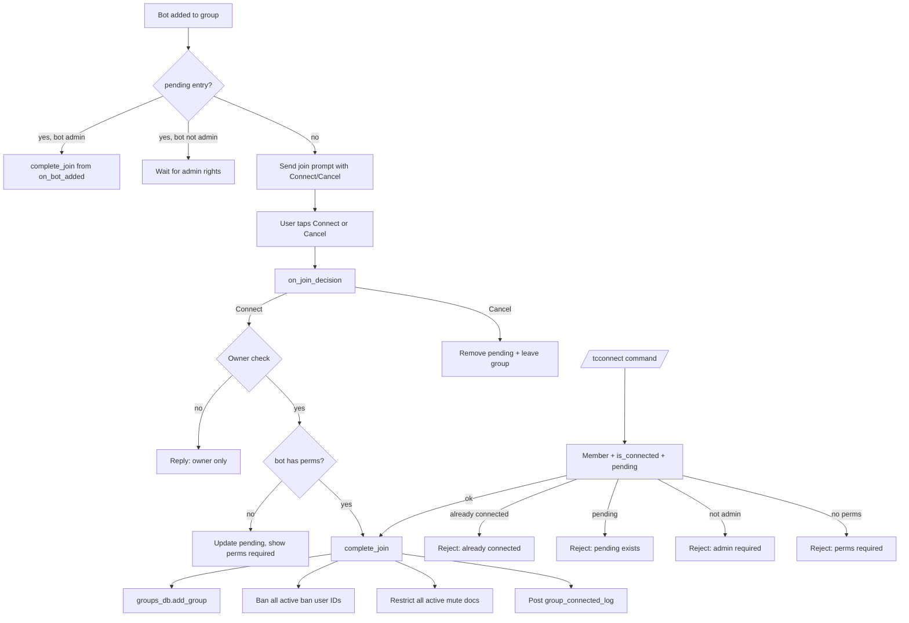

# Connecting

This document describes the current federation group-connect behavior implemented by `tcbot/modules/connecting.py` (the `/tcconnect` entry point) and `tcbot/modules/helper/workflows/connected_flow.py` (the `connection` builder used by the manual command path and the bot-added prompt).

For the disconnect command, see [`disconnecting.md`](disconnecting.md). For the list of currently connected groups, see [`groups.md`](groups.md). For the ban flow applied across connected groups, see [`banning.md`](banning.md). For shared helpers, see [`../../architecture/helpers.md`](../../architecture/helpers.md). For the database layer, see [`../../architecture/database.md`](../../architecture/database.md).

## Purpose

A connected group is a Telegram supergroup or basic group that has been onboarded into the federation. Once connected, the bot enforces existing federation bans and mutes on join, applies new bans/mutes as they are issued, and broadcasts staff messages into the group. There are two ways a group gets connected: a group admin runs `/tcconnect` inside the group, or the bot is added to the group, becomes an administrator, and the group owner taps `Connect` on the auto-sent prompt.

The connection process also replays active federation bans and mutes onto the new group so a freshly connected group is in the same enforcement state as any existing group.

## Commands and aliases

| Command | Alias | Purpose | Access |
|---|---|---|---|
| `/tcconnect` | `/tccon` | Connect the current group to the federation. | Group admins and creators only (checked per-group, not via decorator). |

Commands use the project's configured prefixes; slash commands are examples.

There is no `/tcconnect` alias for the auto-prompt path; the prompt uses inline `Connect` / `Cancel` buttons with callback data `tc_join` and `tc_cancel` (see `BuildConnection` defaults in `connected_flow.py:108-117`).

## `/tcconnect` flow

`/tcconnect` is registered as a plain `MessageHandler`; there is no conversation. The handler:

1. Rejects private chat with `replies.ERR_GROUP_ONLY`.
2. Fetches four independent reads in parallel via `asyncio.gather(..., return_exceptions=True)`:
   - `bot.get_chat_member(chat.id, user.id)` for the executor (bounded with `asyncio.wait_for(timeout=3.0)`).
   - `db.groups_db.is_connected(chat.id)`.
   - `db.groups_db.get_pending(chat.id)`.
   - `bot.get_chat_member(chat.id, bot.id)` for the bot itself, again bounded with `asyncio.wait_for(timeout=3.0)`.
3. If the executor's `get_chat_member` raised, replies `replies.ERR_ROLE_VERIFY` and stops.
4. If the executor is not `administrator` or `creator`, replies `Only group admins can request to connect.` and stops.
5. Rejects primary groups (`cfg.main_group`, `cfg.exec_group`) via `_is_primary_group`: they are required enforcement destinations, not connectable members (the bot-added path refuses them the same way before any prompt or pending row).
6. If `is_connected` is true, replies `connection.already_connected_message()` and stops.
7. If `pending` is set, replies `A connect request for this group is already pending.` and stops.
8. If the bot's `get_chat_member` raised, replies `replies.ERR_ROLE_VERIFY` and stops.
9. If `connection.check_perms(bot_member)` returns False (bot missing one of `can_delete_messages`, `can_restrict_members`, `can_invite_users`), replies `connection.perms_required_message()` and stops.
10. Calls `connection.complete_join(chat.id, chat.title, user.id, user.first_name, ctx.bot)`.
11. If `complete_join` raises, replies `Failed to connect the group due to a server error. Please try again.` and stops. The reply is intentionally not sent until after `complete_join` succeeds, so a DB failure does not produce a false "connected" confirmation.
12. Otherwise, replies `connection.connected_message()`.

## Auto-prompt on bot addition

When the bot joins a group, PTB emits a `my_chat_member` update. `connection.on_bot_added` handles every change to the bot's own member status:

- **Bot removed** (`LEFT` / `BANNED`): runs `is_connected`, `deactivate_group`, and `remove_pending` in parallel. If the group was previously connected, posts a `group_bot_removed_log` and deactivates the record.
- **Bot demoted** (`MEMBER` or `RESTRICTED` from `ADMINISTRATOR`): the group is *not* deactivated because permissions may be restored shortly. A warning is posted to `cfg.logs` (except for the primary groups `cfg.main_group` and `cfg.exec_group`, which are managed separately). Federation bans cannot be enforced until admin rights are restored.
- **Bot promoted to admin with a pending request**: edits the prompt to a progress state first (buttons removed), then runs `complete_join`, and only then edits the prompt to `connected_message`. The pending entry is consumed. (Editing optimistically in parallel was a bug: a `complete_join` failure left the owner with a false confirmation while the group stayed absent from `federated_groups`.) The progress edit matters because the ban/mute replay inside `complete_join` can take minutes on large federations; without it the owner stares at a dead prompt, and the removed buttons close the double-tap window.
- **Bot added to a group with no pending request**: posts `connection.join_prompt()` with `Connect` / `Cancel` buttons and writes a `pending_joins` entry via `db.groups_db.add_pending(chat.id, chat.title, by_user.id, prompt.message_id)`. Anonymous-admin adds are skipped because there is no `from_user` to record as owner.

## `on_join_decision` callback flow

The `Connect` / `Cancel` buttons are handled by `connection.on_join_decision`:

1. Run `q.answer()` and `bot.get_chat_member(chat.id, user.id)` in parallel.
2. If the member lookup raised, edit the prompt reply-markup off and reply `_ERR_ROLE_CHECK_FAILED`.
3. If the member is not the group `OWNER`, edit the reply-markup off and reply `_ERR_OWNER_ONLY`.
4. For `tc_join`:
   - Fetch `bot.get_chat_member(chat.id, bot.id)` bounded with `asyncio.wait_for(timeout=3.0)`. On failure, edit the prompt to `_ERR_BOT_PERMS_VERIFY` and stop.
   - If `connection.check_perms(bot_member)` returns False, write `db.groups_db.add_pending(...)` first (reporting `_ERR_COMPLETE_JOIN` if the write fails, since there is nothing to approve later), then edit the prompt to `connection.perms_required_message()`; the pending entry persists so the owner can retry once the bot is promoted correctly.
    - If `db.groups_db.is_connected(chat.id)` is true, edit the prompt to `connection.already_connected_message()` and stop.
    - Edit the prompt to a progress state (buttons removed), then call `connection.complete_join(...)`. If it raises, edit the prompt to `_ERR_COMPLETE_JOIN` and stop. The success message is intentionally not edited into the prompt until `complete_join` returns successfully, so a DB failure does not produce a false "connected" confirmation. The progress edit keeps the owner informed during the ban/mute replay and closes the double-tap window.
    - Edit the prompt to `connection.connected_message()`.
5. For `tc_cancel`: remove the pending row first (a surviving row would deadlock the next `on_bot_added` join), then edit the prompt to `connection.declined_message()`, post `group_connection_rejected_log` to `cfg.logs`, and `leave_chat(chat.id)` in parallel.

## `complete_join` behavior

`connection.complete_join(chat_id, chat_title, owner_id, owner_fname, bot)` is the shared executor for both paths. It runs the following in parallel via `asyncio.gather(..., return_exceptions=True)`:

- `bot.get_chat(chat_id)` bounded with `asyncio.wait_for(timeout=3.0)` so the chat username can be resolved for the log.
- `db.bans_db.active_ban_user_ids()` - the set of user IDs that currently hold an active federation ban.
- `db.mutes_db.active_mute_docs()` - the set of currently active mutes, filtered to exclude expired timed mutes.
- `bot.get_chat_administrators(chat_id)` bounded with `asyncio.wait_for(timeout=3.0)`.
- `db.groups_db.add_group(chat_id, chat_title, owner_id)` - the critical write; if this raises, `complete_join` re-raises so the caller can detect the failure.
- `db.groups_db.remove_pending(chat_id)` - clear the pending entry if one existed.

After the gather, `complete_join`:

1. Schedules a fire-and-forget admin-identity harvest task that calls `db.users_cache.harvest_user_identity` for every admin so name lookups are available without extra DB or Telegram round-trips later.
2. Fans `bot.ban_chat_member(chat_id, uid)` across every active ban user ID with `fan_out(...)` so a freshly connected group immediately enforces every existing federation ban.
3. Fans `bot.restrict_chat_member(chat_id, uid, permissions=can_send_messages=False, until_date=...)` across every active mute doc with `fan_out(...)`.
4. Posts `parse_logmsg.group_connected_log(chat_id, chat_title, owner_id, owner_fname, chat_username)` to `cfg.logs`.

The function returns normally only after `add_group` has succeeded. If the `add_group` write fails, the exception propagates and neither the federation log nor the success reply is issued.

## Required bot permissions

`connection.check_perms(bot_member)` requires:

- `can_delete_messages`
- `can_restrict_members`
- `can_invite_users`

These are defined as `_REQUIRED_PERMS` in `connected_flow.py:101-105`. The same tuple is exposed via `connection.perms_required_message()` so the help text matches.

## Database impact

The connection flow touches two collections:

`federated_groups` (via `groups_db`):

| Field | Meaning |
|---|---|
| `chat_id` | Telegram chat ID. Unique key. |
| `title` | Last-seen group title. |
| `added_by` | Telegram user ID of the owner who triggered the connection. |
| `added_date` | UTC connection time. |
| `is_active` | Whether the group is currently connected. |

`pending_joins` (via `groups_db`):

| Field | Meaning |
|---|---|
| `chat_id` | Telegram chat ID. Unique key. |
| `title` | Last-seen group title. |
| `owner_id` | Telegram user ID of the owner who initiated the request. |
| `message_id` | Chat message ID of the auto-sent join prompt. |
| `added_date` | UTC request time. |

`add_group` is an `update_one` upsert keyed by `chat_id`, so reconnecting an existing group resets `is_active=True` and updates the title/owner. `add_group` and `add_pending` invalidate the relevant cache entries.

## Edge cases

- `/tcconnect` in a private chat replies `replies.ERR_GROUP_ONLY` and stops.
- A non-admin executor is rejected before any DB lookup runs (`administrator` / `creator` only).
- An already-connected group is rejected without consuming the join prompt.
- A group with a pending request is rejected so two requests cannot race.
- A bot without the required admin permissions is rejected before `complete_join` runs.
- `complete_join` raises `RuntimeError` if `add_group` fails; the success reply is intentionally not sent in that case. Previously the reply was sent in parallel with `complete_join`, which silently swallowed DB failures and produced a false "connected" confirmation.
- The auto-prompt path requires the bot to become an administrator before `complete_join` fires; if the bot is only a member, the pending entry stays and no connect happens until the owner re-promotes and re-taps.
- Anonymous-admin adds to the bot are skipped silently because there is no `from_user.id` to record as owner.
- Demoting the bot (admin -> member/restricted) does *not* deactivate the group; it only posts a warning to the federation log channel.
- Removing the bot (left/banned) deactivates the group, removes any pending entry, and posts a `group_bot_removed_log` to the federation log channel.
- The admin-identity harvest is fire-and-forget; a strong reference is kept in `_harvest_tasks` so the coroutine is not garbage-collected before completion.

## Behavior reference

Key behaviors to keep in mind:

1. `/tcconnect` requires the executor to be `administrator` or `creator` in the target group.
2. `/tcconnect` in private chat is rejected with `replies.ERR_GROUP_ONLY`.
3. The bot must hold `can_delete_messages`, `can_restrict_members`, and `can_invite_users` before `complete_join` fires.
4. The four precondition checks (member, is_connected, pending, bot perms) run in parallel.
5. `complete_join` is awaited before the success reply so DB failures cannot produce a false "connected" confirmation.
6. `complete_join` replays every active ban via `fan_out(bot.ban_chat_member)` and every active mute via `fan_out(bot.restrict_chat_member)`.
7. `complete_join` posts a `group_connected_log` to `cfg.logs` regardless of how many bans/mutes were successfully applied.
8. Adding the bot to a group auto-sends a `Connect` / `Cancel` prompt and writes a `pending_joins` entry.
9. Anonymous-admin adds do not produce a prompt.
10. The auto-prompt path only consumes the pending entry once the bot is promoted to administrator with the required perms.
11. Bot removal deactivates the group, clears any pending entry, and posts a `group_bot_removed_log`.
12. Bot demotion does not deactivate the group; only a warning is posted to `cfg.logs`.
13. The `Connect` button is owner-only; non-owner taps reply `_ERR_OWNER_ONLY`.
14. The `Cancel` button removes the pending entry, edits the prompt to a "Connection declined" message, posts a `group_connection_rejected_log`, and `leave_chat`.
15. The admin-identity harvest task runs in the background so name lookups stay cached for the lifetime of the connected group.
16. Reconnecting an existing group upserts the `federated_groups` record and resets `is_active=True`.