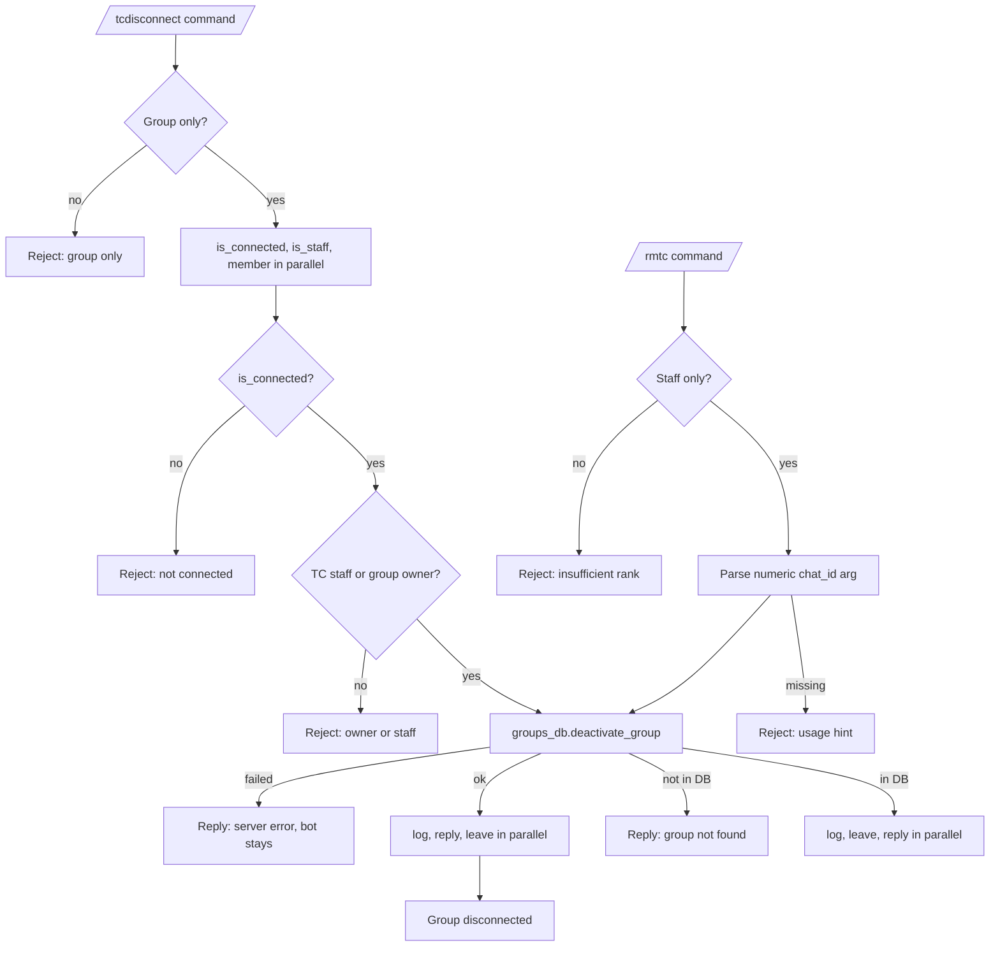

# Disconnecting

This document describes the current federation disconnect behavior implemented by `tcbot/modules/disconnecting.py` (the `/tcdisconnect` and `/rmtc` entry points). The shared connection helpers used here live in `tcbot/modules/helper/workflows/connected_flow.py`.

For the connect flow, see [`connecting.md`](connecting.md). For the list of
currently connected groups, see [`groups.md`](groups.md). For shared helpers,
see [`../../architecture/helpers.md`](../../architecture/helpers.md). For the
database layer, see [`../../architecture/database.md`](../../architecture/database.md).



## Purpose

Disconnection removes a group from the federation. There are two commands for this:

- `/tcdisconnect`: the group owner or any TC staff (Admin and above) can disconnect the current group from inside it. The bot leaves the group after deactivating the record.
- `/rmtc`: TC staff (Admin and above) can force-remove a group by numeric chat ID, including groups the bot has already been kicked from. The bot also `leave_chat`s the ID, which fails silently when the bot is not in the group.

Both commands call `db.groups_db.deactivate_group(chat_id)` to mark the `federated_groups` record inactive and invalidate the connected-groups cache.

## Commands and aliases

| Command | Alias | Purpose | Access |
|---|---|---|---|
| `/tcdisconnect` | `/tcdiscon` | Disconnect the current group from the federation. | Group owner, or TC staff (Admin and above). |
| `/rmtc` | none | Force-remove a group from the federation by chat ID. | TC staff only (`staff_only`). |

Commands use the project's configured prefixes; slash commands are examples.

## `/tcdisconnect` flow

`/tcdisconnect` is registered as a plain `MessageHandler`; there is no conversation. The handler:

1. Rejects private chat with `replies.ERR_GROUP_ONLY`.
2. Fetches three independent reads in parallel via `asyncio.gather(..., return_exceptions=True)`:
   - `db.groups_db.is_connected(chat.id)`.
   - `db.users_roles.is_staff(user.id)`.
   - `bot.get_chat_member(chat.id, user.id)` bounded with `asyncio.wait_for(timeout=3.0)`.
3. If `is_connected` raised or is False, replies `This group is not connected to <community>.` and stops.
4. If the member lookup raised, replies `replies.ERR_ROLE_VERIFY` and stops.
5. Determines `is_group_owner = member.status == "creator"`.
6. If the executor is neither TC staff nor the group owner, replies:
   - For anonymous admins: `Anonymous admin mode is active. Please send this command from your personal account, or ask TC Staff to run /rmtc.`
   - Otherwise: `Only the group owner or TC admins can disconnect this group.`
7. Deactivates first via `db.groups_db.deactivate_group(chat.id)` and only leaves after the DB confirms; on failure replies `Failed to disconnect the group due to a server error. ...` and stops, so a DB error never leaves a ghost (bot gone, DB still active).
8. Then runs three parallel side-effects via `asyncio.gather(..., return_exceptions=True)`:
   - `bot.send_message(cfg.logs, group_disconnected_log(chat.id, chat.title or "Unknown", user.id, user.first_name), parse_mode="HTML", message_thread_id=lt)`.
   - `update.effective_message.reply_text("This group has been disconnected from <community>.")`.
   - `bot.leave_chat(chat.id)`.
9. Each failure is logged at debug or error level but does not roll back the others.

The deactivation runs before the fan-out (not in parallel with it) precisely to avoid the ghost state above. The DB write is still not gated by `leave_chat` succeeding; even if Telegram refuses to remove the bot, the group is marked disconnected so future fan-outs skip it.

## `/rmtc` flow

`/rmtc` is the staff-only remote disconnect:

1. Parse the first arg with `parse_cmd_args(msg.text)`. If missing or not numeric after a `-` strip, replies `Usage: /rmtc <chat_id>` and stops.
2. `chat_id = int(args[0])`.
3. Call `db.groups_db.deactivate_group(chat_id)`. The return value indicates whether the record was matched.
4. If no record matched, replies `replies.ERR_GROUP_NOT_FOUND` and stops.
5. Otherwise runs three parallel side-effects via `asyncio.gather(..., return_exceptions=True)`:
   - `bot.send_message(cfg.logs, group_disconnected_log(chat_id, str(chat_id), admin.id, admin.first_name), parse_mode="HTML", message_thread_id=lt)`.
   - `bot.leave_chat(chat_id)`.
   - `msg.reply_text("Group <chat_id> has been disconnected from <community>", parse_mode="HTML")`.
6. Each failure is logged at debug level but does not roll back the others.

`leave_chat` for a chat the bot is no longer in raises a Telegram API error; the exception is caught and logged at debug level so it does not surface as a command failure.

## Authorization matrix

| Executor | `/tcdisconnect` (in group) | `/rmtc` (remote) |
|---|---|---|
| Founder | Yes | Yes |
| Admin | Yes | Yes |
| Developer | No (not staff) | No (`staff_only` rejects) |
| Tester | No (not staff) | No (`staff_only` rejects) |
| No role | Only if group creator | No (`staff_only` rejects) |
| Anonymous admin | No (always rejected) | No (`staff_only` rejects) |

`/tcdisconnect` has no decorator-level role gate; the in-handler check is `is_tc_staff or is_group_owner`. `/rmtc` is gated by `@decorators.staff_only` so Developer rank alone cannot issue it.

## Database impact

Both commands call `db.groups_db.deactivate_group(chat_id)`, which performs:

```python
update_one({"chat_id": chat_id}, {"$set": {"is_active": False}})
```

The function:

- Returns `True` when `matched_count > 0` (the record existed and was updated).
- Returns `False` when the chat_id has no `federated_groups` record.

It also updates the cache:

- `connected_cache.put(chat_id, False)` so subsequent `is_connected` reads return False.
- `active_groups_cache.invalidate(_ALL_GROUPS_KEY)` so subsequent `active_groups()` reads re-query the DB.

`leave_chat` does not delete the row from `federated_groups`; the row stays as an inactive record. The bot's `my_chat_member` handler will also fire `deactivate_group` again when the bot actually leaves, but it is a no-op at that point.

## Logs

Both commands post the same template via `parse_logmsg.group_disconnected_log`:

| Template | Used for |
|---|---|
| `group_disconnected_log` | Federation log entry for both `/tcdisconnect` and `/rmtc`. |

The log includes:

- Community name.
- Group title (or the chat ID as a string for `/rmtc`).
- Moderator mention and user ID.
- Date.

## Edge cases

- `/tcdisconnect` in a private chat replies `replies.ERR_GROUP_ONLY` and stops.
- An executor who is not the group creator and not TC staff is rejected with a friendly message; anonymous admins get the dedicated anonymous-mode reply.
- A group that is not connected replies `This group is not connected to <community>.` and stops.
- `/rmtc` without a numeric chat ID replies `Usage: /rmtc <chat_id>` and stops.
- `/rmtc` for a chat ID that has no `federated_groups` record replies `replies.ERR_GROUP_NOT_FOUND` and stops.
- `/rmtc` for a chat the bot is not in still runs `leave_chat`, which raises a Telegram API error that is caught and logged at debug.
- The DB deactivation is not gated on `leave_chat`; even if Telegram refuses to remove the bot, the group is marked disconnected.
- Federation log send failures do not roll back the deactivation; the group is still marked inactive.
- Reply send failures do not roll back the deactivation.
- The bot's own `my_chat_member` handler will also call `deactivate_group` when the bot is removed from the group; that call is a no-op once the group has already been deactivated by this command.

## Behavior reference

Key behaviors to keep in mind:

1. `/tcdisconnect` is group-only; private chat replies `replies.ERR_GROUP_ONLY`.
2. `/tcdisconnect` allows the group owner (creator) or any TC staff (Admin and above).
3. `/tcdisconnect` runs the three precondition reads in parallel.
4. The deactivation runs first; only the log post, reply, and `leave_chat` run in parallel after it succeeds.
5. An anonymous admin cannot run `/tcdisconnect`; the reply directs them to ask TC staff to use `/rmtc`.
6. `/rmtc` requires TC staff (`staff_only` rejects Developer/Tester/no-role).
7. `/rmtc` requires a numeric chat ID; the arg must pass `args[0].lstrip("-").isdigit()`.
8. `/rmtc` for an unknown chat ID replies `replies.ERR_GROUP_NOT_FOUND`.
9. `/rmtc` runs `leave_chat` even when the bot is not in the target chat; the API error is caught and logged.
10. Both commands post `group_disconnected_log` to `cfg.logs`.
11. The cache invalidation runs inside `deactivate_group` so subsequent `is_connected` and `active_groups` reads return up-to-date state.
12. The `federated_groups` row is not deleted; it stays as an inactive record.
13. The bot's own `my_chat_member` handler is idempotent with these commands.
14. The DB deactivation is not gated on `leave_chat`; even if Telegram refuses to remove the bot, the group is marked disconnected.
15. Federation log send failures do not roll back the deactivation.
16. The help text notes that `/rmtc` can remove groups the bot has been kicked from; that is the primary operational use case.