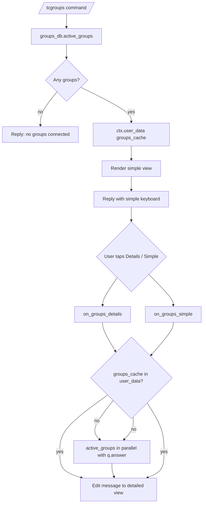

# Groups

This document describes the current connected-group list behavior implemented by `tcbot/modules/groups.py` (the `/tcgroups` command and the inline toggle callbacks) and `tcbot/database/groups_db.py` (the shared connected-groups collection and cache).

For the connect flow, see [`connecting.md`](connecting.md). For the disconnect
flow, see [`disconnecting.md`](disconnecting.md). For shared helpers, see
[`../../architecture/helpers.md`](../../architecture/helpers.md). For the
database layer, see [`../../architecture/database.md`](../../architecture/database.md).



## Purpose

`/tcgroups` lists every group currently connected to the federation, with an optional `Details` view that adds each group's chat ID alongside its title. The command is open to anyone, so the same `/tcgroups` reply in any chat shows the same global list.

The list source is `groups_db.active_groups()`, which reads `federated_groups` where `is_active: True`. The result is cached per-user in `ctx.user_data["groups_cache"]` so the toggle callbacks can edit the existing message in place without re-querying the DB on every tap.

## Commands and aliases

| Command | Alias | Purpose | Access |
|---|---|---|---|
| `/tcgroups` | `/tcg` | List every group currently connected to the federation. | Anyone. |

Commands use the project's configured prefixes; slash commands are examples.

## `/tcgroups` flow

`/tcgroups` is registered as a plain `MessageHandler`; there is no conversation. The handler:

1. Fetches the active-groups list with `db.groups_db.active_groups()`. This call is backed by the L1+L2 cache defined in `tcbot/database/cache.py`, so repeat calls within the cache TTL are free.
2. If the list is empty, replies `No groups are currently connected to <community>.` and stops.
3. Otherwise caches the list in `ctx.user_data["groups_cache"]` and replies with the simple view rendered by `_render(groups, detailed=False)`.
4. The reply keyboard is `tcgroups_kb(detailed=False)` from `tcbot/modules/helper/keyboards.py` and exposes a single `Details` button.

## Render helpers

`_render(groups, detailed)` is the local helper in `groups.py`:

```python
def _render(groups, *, detailed):
    lines = [f"{bold('Connected Groups')}\n\nCount: {len(groups)}\n"]
    for g in groups:
        title = g.get("title", "Unknown")
        if detailed:
            lines.append(f"- {esc(title)} - {code(str(g.get('chat_id', 0)))}")
        else:
            lines.append(f"- {esc(title)}")
    return "\n".join(lines)
```

The function escapes every title with `esc()` and uses `code()` to wrap chat IDs in the detailed view. Titles default to `Unknown` when the group record has none.

## Toggle callbacks

Two `CallbackQueryHandler` registrations handle the inline toggle:

- `on_groups_details` with pattern `^groups_details$`.
- `on_groups_simple` with pattern `^groups_simple$`.

Both call the shared `_toggle(update, ctx, detailed=...)` helper:

1. If `ctx.user_data["groups_cache"]` exists, run `q.answer()` and `safe_edit(message, _render(groups, detailed=...), reply_markup=tcgroups_kb(detailed=...))` in parallel via `asyncio.gather(..., return_exceptions=True)`.
2. Otherwise (the user re-tapped after a bot restart), run `q.answer()` and `db.groups_db.active_groups()` in parallel. The new list is stashed in `ctx.user_data["groups_cache"]` and the message is edited through `safe_edit`.

`safe_edit` swallows benign `BadRequest` errors (such as `Message is not modified`) so re-tapping a button that is already in view does not surface a Telegram error to the user.

## Required bot permissions

The command itself does not require any bot permissions; it only reads from the federation DB. However, every connected group must have granted the bot `can_delete_messages`, `can_restrict_members`, and `can_invite_users`; that requirement lives in [`connecting.md`](connecting.md).

## Database impact

`/tcgroups` does not write to the database. It reads `federated_groups` through `groups_db.active_groups()` and renders the result.

`federated_groups` document fields used by the renderer:

| Field | Meaning |
|---|---|
| `chat_id` | Telegram chat ID. |
| `title` | Last-seen group title. |
| `is_active` | Whether the group is currently connected. |

`active_groups` filters on `is_active: True`. The call goes through `active_groups_cache.get_or_fetch(_ALL_GROUPS_KEY, _fetch)` so the cache layer short-circuits repeated reads within the TTL.

The cache is invalidated whenever `add_group`, `deactivate_group`, or `migrate_group` mutates the collection, so the listing picks up new connects, disconnects, and supergroup migrations without manual intervention.

## Edge cases

- An empty list replies `No groups are currently connected to <community>.` and does not show the toggle keyboard.
- A group with a missing `title` renders as `Unknown`.
- The cached list in `ctx.user_data["groups_cache"]` becomes stale after a `/tcconnect` or `/tcdisconnect` elsewhere in the federation; the toggle callback re-fetches only when the cache is missing entirely. Users who need a fresh list should re-run `/tcgroups`.
- `safe_edit` silently swallows `Message is not modified` errors, so re-tapping a button already in view does not raise a Telegram error.
- The L1+L2 cache backed by `active_groups_cache` short-circuits repeat reads within the TTL; the DB is only queried on cache miss.
- Disconnected groups (`is_active: False`) are excluded from the list because `active_groups` filters on `is_active: True`.
- The command is open to anyone; no decorator-level role gate.

## Behavior reference

Key behaviors to keep in mind:

1. `/tcgroups` is open to anyone.
2. `/tcgroups` renders a title-only list by default with a `Count: N` line.
3. `/tcgroups` with no connected groups replies a friendly empty-state message.
4. The rendered list is cached in `ctx.user_data["groups_cache"]` so toggles are cheap.
5. `Details` switches the view to include each group's chat ID alongside its title.
6. `Simple` switches back to the title-only view.
7. Toggle callbacks prefer the cached list and only re-query the DB when the cache is missing entirely.
8. `safe_edit` swallows benign `BadRequest` errors so re-tapping a button does not raise a Telegram error.
9. The list source is `groups_db.active_groups()` filtered on `is_active: True`.
10. The L1+L2 cache short-circuits repeat reads within the TTL.
11. The cache is invalidated whenever `add_group`, `deactivate_group`, or `migrate_group` runs.
12. Disconnected groups are excluded from the list.
13. A group with a missing title renders as `Unknown`.
14. `/tcgroups` does not write to the database.
15. `/tcgroups` is reply-only; there is no conversation state.
16. The reply uses `parse_mode="HTML"` and escapes every title through `esc()`.