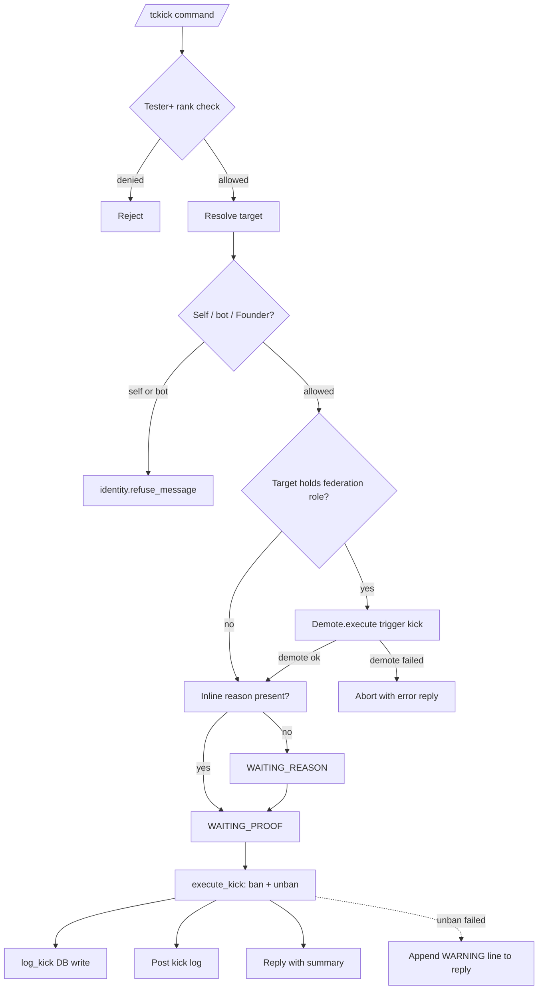

# Kicking

This document describes the current group kick behavior implemented by `tcbot/modules/kicking.py` (the `/tckick` entry point and decorators), `tcbot/modules/helper/workflows/kicking_flow.py` (the `execute_kick` executor and conversation factory), `tcbot/modules/helper/workflows/reason_flow.py` (the shared proof/reason conversation invoked by kick), and `tcbot/database/kicks_db.py` (the persistent kick log).

For the ban flow, see [`banning.md`](banning.md). For the mute flow, see
[`muting.md`](muting.md). For role auto-demotion on kick, see
[`../roles/demote.md`](../roles/demote.md). For warnings and kicks, see
[`check.md`](check.md). For shared helpers, see
[`../../architecture/helpers.md`](../../architecture/helpers.md). For the
database layer, see [`../../architecture/database.md`](../../architecture/database.md).



## Purpose

A kick removes a user from the current group only, not from the federation. The implementation ban-then-unbans the user in the current chat so they can rejoin via invite link; federation-wide enforcement is reserved for `/tcban`. The kick flow accepts an optional inline reason, supports optional proof, posts a kick log, and writes an audit row to the `kicks` collection. Targets that hold a federation role are auto-demoted before the kick to preserve the role-vs-state invariant.

## Commands and aliases

| Command | Alias | Purpose | Access |
|---|---|---|---|
| `/tckick` | `/tck` | Remove a user from the current group. | Tester and above via `basic_mod_only`. |

Commands use the project's configured prefixes; slash commands are examples.

## `/tckick` flow

The kick command is a `ConversationHandler` built by `reason_flow.build_modaction_conv(reason, proof, ...)` so it reuses the standard reason/proof state machine.

1. A moderator runs `/tckick <target> <reason>` or replies to a message with `/tck <reason>`.
2. The bot resolves the executor role and target in parallel.
3. The executor must have at least Tester rank.
4. The target must resolve to a Telegram user ID.
5. The bot rejects attempts to kick itself or the executor's own account via `identity.refuse_message`.
6. If the target holds a federation role, `Demote.execute(..., trigger="kick")` runs first. If the demote raises, the command aborts with an error reply and the kick is not attempted.
7. If an inline reason was supplied, the bot skips directly to proof collection (`WAITING_PROOF`). Otherwise it prompts for a reason (`WAITING_REASON`).
8. Reason is skippable via the `Skip` button; the recorded reason becomes `replies.NO_REASON` when skipped.
9. Proof is skippable via the `Skip` button. When supplied, one or more photos/videos upload to `cfg.proofs` through `proof_flow.upload_proof`.
10. `execute_kick` ban-then-unbans the target in the current chat, writes a `kicks_db.log_kick(...)` audit row, posts a kick log to `cfg.logs`, and replies with the summary.

## Target resolution and reason parsing

The target can be specified by:

- Replying to a message from the target.
- Passing a numeric user ID after the command.
- Passing an `@username` after the command, when resolvable by the project's extraction helper.

Reason parsing in `cmd_kick` uses `reason_flow.parse_inline_reason(args, has_explicit_target=...)` so:

```text
/tckick @username being disruptive
# target: @username
# reason: being disruptive

/tckick 123456789
# target: 123456789
# reason: empty - bot prompts

# Reply to a message:
/tck flooding the chat
# target: replied user
# reason: flooding the chat
```

When no inline reason remains after parsing, the bot enters `WAITING_REASON` and asks for text or `Skip`.

## Reason and proof behavior

The kick conversation uses `BuildReason("kick")` and `BuildProof("kick")` (both default to `skip_allowed=True`). Both keyboards expose `Skip` (when allowed) and `Cancel`:

- Reason: text, `Skip`, `Cancel`.
- Proof: photo, video, `Skip`, `Cancel`.

The reason keyboard is built by `keyboards.reason_skip` (default `Skip`/`Cancel`). The proof keyboard is built by `proof.keyboard()` and only contains buttons when the underlying `BuildProof` allows them.

`WAITING_REASON` and `WAITING_PROOF` use the `_ModActionFlow` class in `reason_flow.py`. Its key invariants:

- `_on_proof` sets `ctx.user_data[action_executing]` before the first await to close the race window. A second concurrent proof update returns `ConversationHandler.END` immediately.
- Album dedup: each photo in a multi-photo album shares a `media_group_id`; only the first photo invokes the executor.
- The proof prompt message ID is stashed in `ctx.user_data` so the reason step can edit it in place when transitioning to `WAITING_PROOF`.
- The fallback filter swallows any other command during the conversation unless the user types a recognized command, in which case the conversation ends with `<action> operation cancelled.`

## Auto-demote before kick

If the target holds a federation role, `cmd_kick` calls `Demote.execute(ctx.bot, target_id, ..., trigger="kick")` before opening the reason prompt.

`Demote.execute` removes the role record (`tc_admins` for Admin, `tc_roles` for Developer/Tester), sends the federation demote log, and DMs the target. If it raises, `cmd_kick` aborts with:

```text
<target> holds a federation role (<role>) and the auto-demote step failed,
so the kick cannot proceed safely. Demote them manually with /tcdemote and
retry the kick.
```

The kick is not attempted in this case; previously this exception was swallowed silently and the kick would still execute on a role-holding target.

## `execute_kick` behavior

`execute_kick(update, ctx, target_id, target_name, reason_text, proof_msgs)` lives in `tcbot/modules/helper/workflows/kicking_flow.py:43-146`. The implementation is a single Telegram `ban_chat_member` followed by `unban_chat_member(chat_id, target_id, only_if_banned=True)`. The "kick" is therefore not a separate Telegram primitive, but the visible effect of ban-then-unban in the same chat.

Execution order:

1. Upload proof to `cfg.proofs` when `proof_msgs` is non-empty. The proof caption uses `parse_logmsg.proof_caption_new`. If upload fails, the kick still proceeds with no proof link.
2. Call `ctx.bot.ban_chat_member(chat_id, target_id)` to remove the user.
3. Re-check the target's effective role and re-run `Demote.execute(..., trigger="kick")` when staff, closing the proof-collection TOCTOU window (best-effort; the kick proceeds even if the re-demote fails).
4. Fan three independent side-effects in parallel with `asyncio.gather(..., return_exceptions=True)`:
   - `unban_chat_member(chat_id, target_id, only_if_banned=True)` - the "user can rejoin" step.
   - `db.kicks_db.log_kick(target_id, chat_id, reason_text, admin_id)` - audit row.
   - `ctx.bot.send_message(cfg.logs, kick_log, ..., reply_markup=proof_kb)` - federation log post.
5. If the unban call raises, the reply text is appended with a `WARNING:` line so the moderator is told the user is still banned in this chat.
6. The reply reads `<user> has been kicked. Reason: <reason>. They can rejoin via invite link.` plus the optional `WARNING:` line.

If `ban_chat_member` itself raises (the chat-level exception, not the parallelized children), `execute_kick` catches it, logs the full traceback, and replies with a generic permissions/retry hint (raw error text is never echoed to the chat).

## Database impact

Kick audit records are stored in the `kicks` collection. Each record contains:

| Field | Meaning |
|---|---|
| `user_id` | Telegram user ID of the kicked user. |
| `chat_id` | Group chat ID where the kick happened. |
| `reason` | Moderator-provided reason or `replies.NO_REASON` when skipped. |
| `admin_id` | Telegram user ID of the moderator who issued the kick. |
| `timestamp` | UTC kick creation time. |

`kicks_db.log_kick` is the only insert path. `kicks_db.user_kicks` and `kicks_db.user_kick_count` power the `/check` profile drill-down.

Indexes are ensured for:

- `kicks`: `(user_id, timestamp -1)` for `user_kicks` history list.

## Logs and keyboards

Kick-related templates are defined in `parse_logmsg.py`:

| Template | Used for |
|---|---|
| `proof_caption_new` | Caption on kick proof uploads. |
| `kick_log` | Federation log entry posted by `execute_kick`. |

The reply and federation log use `keyboards.action_proof_kb(target_id, proof_link)`. The keyboard exposes a single `Proof <target_id>` URL button when a proof link was generated; the button is omitted when no proof was uploaded.

## Edge cases

- A kick in a chat where the user has never been a member is a no-op for `ban_chat_member` and a true no-op for the post-ban `unban_chat_member` (with `only_if_banned=True`).
- Proof upload failures are caught and logged; the kick still proceeds.
- DB `log_kick` failure does not stop the kick or the federation log post.
- Federation log send failure does not stop the kick reply.
- If the post-ban `unban_chat_member` fails, the user is effectively banned in this chat. The reply now appends a `WARNING:` line explaining this and recommending a manual chat-member unban (previously the failure was a silent false success).
- Auto-demote failure aborts the kick before the reason prompt; previously the failure was swallowed and the kick proceeded anyway.
- The reason and proof conversation is per-chat and per-user, so simultaneous kick flows are isolated.
- The kick command is **group-only**; it cannot be used in private chats because `basic_mod_only` requires a rank check that resolves through the connected-group context.
- The `/tckick` executor is not gated on `mod_only`; any Tester or higher can issue it.

## Behavior reference

Key behaviors to keep in mind:

1. `/tckick` works in the current group only; no fan-out, no federation-wide ban.
2. `/tckick` requires Tester rank.
3. `/tckick` without a target is rejected with `replies.ERR_CANNOT_RESOLVE`.
4. Self-kick and bot-kick attempts are rejected by `identity.refuse_message`.
5. Higher-rank or equal-rank targets are rejected by `resolve_and_check`.
6. Role-holding targets are auto-demoted before the kick; if the demote fails the kick is aborted with an error reply.
7. Reason is skippable; skipped reason records as `replies.NO_REASON`.
8. Proof is skippable; skipped proof records nothing.
9. The `WAITING_PROOF` step accepts photos and videos; non-media messages bounce with a friendly prompt.
10. Albums are deduped by `media_group_id`; only the first photo invokes the executor.
11. The proof prompt edits in place across the reason-to-proof transition when a prompt ID is stashed in `ctx.user_data`.
12. `execute_kick` runs `ban_chat_member` then `unban_chat_member(..., only_if_banned=True)` so the user can rejoin via invite link.
13. The federation log post and the DB `log_kick` happen in parallel with the post-ban unban; partial failures are logged but the kick still completes.
14. A failed post-ban unban adds a `WARNING:` line to the reply; the user is still banned in this chat.
15. `/tcban` and `/tckick` are distinct: only `/tcban` creates a federation-wide ban record and appeal path.
16. The reply always reads `They can rejoin via invite link.` because the post-ban unban is part of the contract.