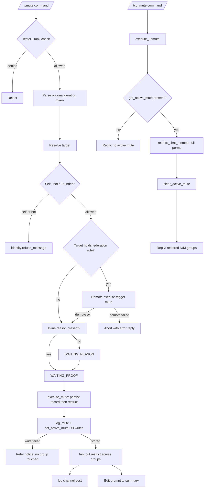

# Muting

This document describes the current federation mute and unmute behavior implemented by `tcbot/modules/muting.py` (the `/tcmute` and `/tcunmute` entry points), `tcbot/modules/helper/workflows/muting_flow.py` (the `execute_mute` and `execute_unmute` executors plus duration helpers), `tcbot/modules/helper/workflows/reason_flow.py` (the shared proof/reason conversation), and `tcbot/database/mutes_db.py` (the persistent `mutes` and `active_mutes` collections).

For the ban flow, see [`banning.md`](banning.md). For the kick flow, see
[`kicking.md`](kicking.md). For role auto-demotion on mute, see
[`../roles/demote.md`](../roles/demote.md). For shared helpers, see
[`../../architecture/helpers.md`](../../architecture/helpers.md). For the
database layer, see [`../../architecture/database.md`](../../architecture/database.md).



## Purpose

A federation mute restricts a user from sending messages, media, stickers, and polls across all active connected groups at once, plus the primary groups (`cfg.main_group`, `cfg.exec_group`). Mutes may be timed (with a duration token) or permanent (`until_date=None`). The mute flow accepts an optional inline reason and optional proof, posts a federation mute log, writes an audit row to the `mutes` collection, and persists an active-mute record in `active_mutes` so unmute and group-connect replay can find it. Targets that hold a federation role are auto-demoted before the mute.

`/tcunmute` clears the active-mute record and restores full send permissions across the same set of groups.

## Commands and aliases

| Command | Alias | Purpose | Access |
|---|---|---|---|
| `/tcmute` | `/tcm` | Apply a federation-wide mute to a user. | Tester and above via `basic_mod_only`. |
| `/tcunmute` | `/tcunm`, `/tcum` | Restore full send permissions across all connected groups. | Tester and above via `basic_mod_only`. |

Commands use the project's configured prefixes; slash commands are examples.

## `/tcmute` flow

The mute command is a `ConversationHandler` built by `reason_flow.build_modaction_conv(reason, proof, ...)` and inherits all reason/proof state machine semantics from the shared factory. The mute conversation factory is wired with `escape_filter=_UNMUTE_CMDS` so that `/tcunmute` typed during a mute conversation is delivered to the unmute handler instead of being swallowed by the mute fallback.

1. A moderator runs `/tcmute <target> [duration] [reason]` or replies to a message with `/tcm [duration] [reason]`.
2. The bot resolves the executor role and target in parallel.
3. The executor must have at least Tester rank.
4. The target must resolve to a Telegram user ID.
5. The bot rejects attempts to mute itself or the executor's own account via `identity.refuse_message`.
6. If the target holds a federation role, `Demote.execute(..., trigger="mute")` runs first. If the demote raises, the command aborts with an error reply and the mute is not attempted.
7. The bot parses an optional duration token from the first remaining argument.
8. If an inline reason was supplied, the bot skips directly to proof collection (`WAITING_PROOF`). Otherwise it prompts for a reason (`WAITING_REASON`).
9. Reason is skippable via the `Skip` button.
10. Proof is skippable via the `Skip` button.
11. `_execute_mute` restricts the target across all active connected groups plus primary groups, writes the active-mute record, posts the mute log, and edits the prompt to a summary.

## Duration token format

The duration regex is `_DURATION_RE` in `muting_flow.py:39`:

```python
_DURATION_RE = re.compile(r"^(\d+)(ye|mo|[smhdw])$", re.IGNORECASE)
```

| Token | Unit |
|---|---|
| `s` | seconds |
| `m` | minutes |
| `h` | hours |
| `d` | days |
| `w` | weeks (7 days) |
| `mo` | months (30 days) |
| `ye` | years (365 days) |

`parse_duration("3d")` returns `timedelta(days=3)`. A token that fails the regex never matches the duration guard and stays in the reason text. A regex-valid but unparsable token (timedelta overflow or above the 100-year `_MAX_DURATION_DAYS=36500` cap) makes `parse_duration` return `None`, and the token is kept as reason text as well: it is popped from the arg list only after a successful parse, so moderator input is never silently dropped.

`fmt_duration(td)` renders:

- `total < 60` -> `Ns`
- `< 1 hour` -> `Nm`
- `< 1 day` -> `Nh`
- `< 7 days` -> `Nd`
- `< 30 days` -> `Nw`
- `< 1 year` -> `Nmo`
- else -> `Nye`

A `None` duration renders as `permanently` and is passed to `restrict_chat_member` with `until_date=None`, producing a permanent restriction.

## Target resolution and reason parsing

The target can be specified by:

- Replying to a message from the target.
- Passing a numeric user ID after the command.
- Passing an `@username` after the command, when resolvable.

`cmd_mute` strips the target token first, then attempts to parse the duration token from the head of the remaining list. Anything left after the duration is the inline reason:

```text
/tcmute @username 3d spamming in chat
# target: @username
# duration: 3d
# reason: spamming in chat

/tcm 123456789 1w
# target: 123456789
# duration: 1w
# reason: empty - bot prompts

/tcmute @username
# target: @username
# duration: none (permanent)
# reason: empty - bot prompts
```

The reason prompt and proof prompt are stamped with `extra_info` (`<code id>: <duration>`) so the moderator sees the duration even when no reason was typed inline.

When the command replies to a user message, the reply wins in `extract_target`, so every argument is duration/reason text: a leading numeric or `@username` token is never consumed as a target. The shared `extraction.has_reply_target()` helper owns this check.

## Reason and proof behavior

The mute conversation uses `BuildReason("mute")` and `BuildProof("mute")` (both default to `skip_allowed=True`). Both keyboards expose `Skip` (when allowed) and `Cancel`:

- Reason: text, `Skip`, `Cancel`.
- Proof: photo, video, `Skip`, `Cancel`.

The `_ModActionFlow` class in `reason_flow.py` enforces the same race-safe semantics described in [`kicking.md`](kicking.md): album dedup via `media_group_id`, double-submit guard via `ctx.user_data[mute_executing]`, fallback cancel on any unrecognized command.

## Auto-demote before mute

If the target holds a federation role, `cmd_mute` calls `Demote.execute(ctx.bot, target_id, ..., trigger="mute")` before opening the reason prompt. If `Demote.execute` raises, `cmd_mute` aborts with:

```text
<target> holds a federation role (<role>) and the auto-demote step failed,
so the mute cannot proceed safely. Demote them manually with /tcdemote and retry the mute.
```

The mute is not attempted in this case; previously this exception was swallowed silently and the mute would still proceed on a role-holding target.

## `execute_mute` behavior

`_execute_mute(bot, update, meta)` lives in `tcbot/modules/helper/workflows/muting_flow.py`. The executor reads target ID, name, reason, admin, duration, proof messages, and the prompt chat/ID from the `meta` dict.

Execution order:

1. Resolve the origin chat from the update; abort before any side effect when it is absent.
2. Build the active-groups list: `groups_db.active_groups()` plus any primary groups (`cfg.main_group`, `cfg.exec_group`) that are not already present. A fetch outage aborts with a retry notice and no group is touched.
3. Persist `db.mutes_db.log_mute(...)` and `db.mutes_db.set_active_mute(target_id, until=until)` first. Either write failing aborts with a retry notice and no group is touched (fail-closed, mirroring the ban flow and the warn auto-ban): enforcing chats without an `active_mutes` row would leave a restriction that `/tcunmute` refuses to lift.
4. Build the restriction `ChatPermissions(can_send_messages=False)` and the `until_date` value (`utc_now() + duration` or `None` for permanent).
5. Re-check the target's effective role and re-run `Demote.execute(..., trigger="mute")` when staff, closing the proof-collection TOCTOU window (best-effort; the mute proceeds even if the re-demote fails).
6. Fan `restrict_chat_member` across the group list with `fan_out(...)`. Failed calls are counted with `count_transient_errors(results)`.
7. Upload proof to `cfg.proofs` when `proof_msgs` is non-empty. The proof caption uses `parse_logmsg.proof_caption_new`. If upload fails, the mute still proceeds with no proof link.
8. Run two parallel side-effects via `asyncio.gather(..., return_exceptions=True)`:
    - `bot.send_message(cfg.logs, mute_log, ..., reply_markup=proof_kb)`.
    - `bot.edit_message_text(summary, chat_id=prompt_chat, message_id=prompt_id, ..., reply_markup=proof_kb)` so the moderator sees the result inline.
9. If the prompt edit fails, a fallback `msg.reply_text(summary, ..., reply_markup=proof_kb)` is issued.

The summary text reads `<user> has been muted <duration>. Reason: <reason>. Applied to <ok>/<total> groups.`

The fan-out errors are counted but do not roll back the DB mute record; group connect replay will retry missing restrictions on the next reconnect.

## `/tcunmute` flow

`cmd_unmute(update, ctx)` is registered as a plain `MessageHandler` rather than a `ConversationHandler` step. The flow is:

1. Resolve target.
2. Reject unresolved target with `replies.ERR_CANNOT_RESOLVE`.
3. Run `identity.classify` and `resolve_and_check` in parallel (Tester minimum). If the executor is outranked or the target is self/bot, `identity.refuse_message` short-circuits.
4. Emit `identity.staff_notice("unmute", ident, cfg.community_name)` when applicable so staff-only targets see the heads-up.
5. Delegate to `execute_unmute(update, ctx, target_id, target_name)`.

`execute_unmute` is the unmute executor:

1. Guard: `db.mutes_db.get_active_mute(target_id)` must return a record. If `None`, reply `<user> has no active federation mute.` and stop. This guard prevents a misleading "restored N/N groups" reply for a no-op.
2. Build the full-perms `ChatPermissions` with all messaging permissions enabled.
3. Fan `restrict_chat_member(chat_id, target_id, permissions=full_perms)` across the same group list used by `execute_mute`.
4. Run three parallel side-effects via `asyncio.gather(..., return_exceptions=True)`:
   - `db.mutes_db.clear_active_mute(target_id)`.
   - `bot.send_message(cfg.logs, unmute_log, ...)`.
   - `msg.reply_text(reply, ...)`.

The reply reads `<user> has been unmuted - restored in <ok>/<total> groups.`

## Database impact

The `mutes` collection stores audit rows; `active_mutes` stores the live restriction record.

`mutes` document fields:

| Field | Meaning |
|---|---|
| `user_id` | Muted Telegram user ID. |
| `chat_id` | Group chat ID where the mute command was issued. |
| `reason` | Moderator-provided reason or `replies.NO_REASON`. |
| `admin_id` | Telegram user ID of the moderator. |
| `timestamp` | UTC mute creation time. |
| `duration_secs` | Optional; total seconds when the mute is timed. |

`active_mutes` document fields:

| Field | Meaning |
|---|---|
| `user_id` | Muted Telegram user ID. |
| `until_date` | UTC datetime when the restriction expires, or `None` for permanent. |
| `timestamp` | UTC record-write time. |

Expired timed mutes are filtered at query time by `get_active_mute` and `active_mute_docs` using the predicate `$or: [{until_date: None}, {until_date: {$gt: now}}]`. There is no background cleanup job.

`active_mutes` is consumed by:

- `execute_unmute` to decide whether to proceed.
- `on_bot_added` -> `connection.complete_join` -> `mutes_db.active_mute_docs()` so newly connected groups replay the mute immediately via `restrict_chat_member`.

## Logs and keyboards

Mute-related templates are defined in `parse_logmsg.py`:

| Template | Used for |
|---|---|
| `proof_caption_new` | Caption on mute proof uploads. |
| `mute_log` | Federation log entry posted by `execute_mute`. |
| `unmute_log` | Federation log entry posted by `execute_unmute`. |

The reply and federation log use `keyboards.action_proof_kb(target_id, proof_link)`. The keyboard exposes a single `Proof <target_id>` URL button when a proof link was generated; the button is omitted when no proof was uploaded.

## Edge cases

- A duration token that fails the regex is silently dropped and treated as part of the reason text.
- Auto-demote failure aborts the mute before the reason prompt; previously the failure was swallowed and the mute proceeded anyway.
- `execute_unmute` with no active mute record replies `<user> has no active federation mute.` and does not fan `restrict_chat_member` across the groups.
- A failed active-mute read fails closed with a retry notice instead of being treated as "no active mute".
- `get_active_mute` filters out expired timed mutes at query time, so a stale `active_mutes` row never produces a misleading "restored N/N groups" success.
- The `_UNMUTE_CMDS` filter is passed to the mute conversation factory as `escape_filter`, so `/tcunmute` typed during `WAITING_REASON` or `WAITING_PROOF` reaches the unmute handler instead of cancelling the mute conversation.
- `restrict_chat_member` with `until_date=None` produces a permanent restriction on Telegram's side; the bot does not schedule a timed unban through APScheduler.
- Mute enforcement in newly connected groups is handled at connect time by `connection.complete_join` -> `active_mute_docs`, not by a scheduler job.

## Behavior reference

Key behaviors to keep in mind:

1. `/tcmute` requires Tester rank.
2. `/tcmute <target> <duration> <reason>` parses the duration token before the reason text.
3. `/tcmute` without a target is rejected with `replies.ERR_CANNOT_RESOLVE`.
4. Self-mute and bot-mute attempts are rejected by `identity.refuse_message`.
5. Higher-rank or equal-rank targets are rejected by `resolve_and_check`.
6. Role-holding targets are auto-demoted before the mute; if the demote fails the mute is aborted with an error reply.
7. Reason is skippable; skipped reason records as `replies.NO_REASON`.
8. Proof is skippable; skipped proof records nothing.
9. The `_UNMUTE_CMDS` filter is excluded from the mute conversation fallback so unmute can interrupt a pending mute conversation.
10. `execute_mute` restricts across `active_groups()` plus `cfg.main_group`/`cfg.exec_group`, deduplicated.
11. `execute_mute` writes both `log_mute` (audit) and `set_active_mute` (live record) so group connect can replay.
12. `execute_unmute` refuses to fan unrestrict calls when no active mute record exists.
13. The `until_date` value matches the value passed to `restrict_chat_member`; `None` means permanent.
14. Expired timed mutes are excluded from `get_active_mute` and `active_mute_docs` by query-time filtering.
15. Federation log send failure does not roll back the mute.
16. Newly connected groups reapply active mutes on connect via `connection.complete_join`.