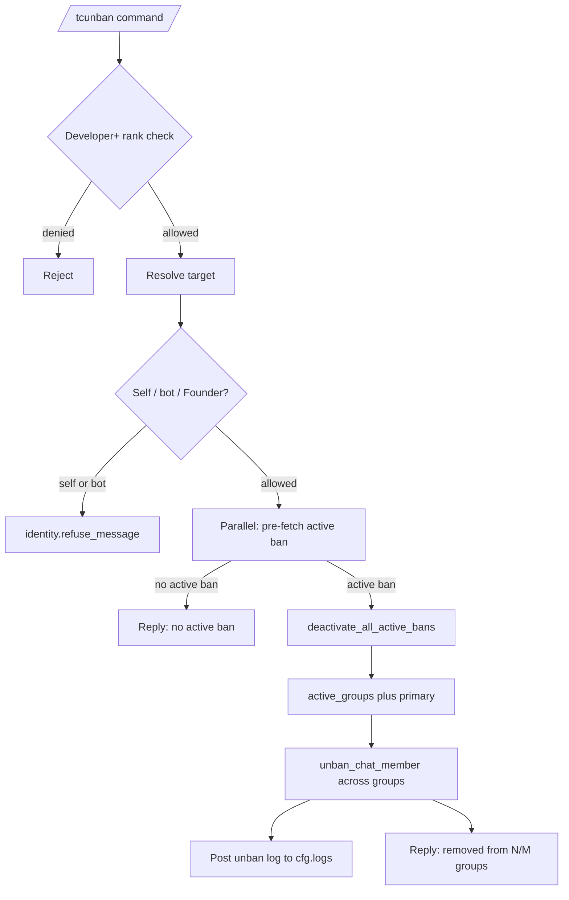

# Unbanning

This document describes the current federation unban behavior implemented by `tcbot/modules/unbanning.py` (the `/tcunban` entry point) and `tcbot/modules/helper/workflows/unban_flow.py` (the `execute_unban` executor). Persistent ban state lives in `tcbot/database/bans_db.py`; only the unban-relevant helpers are documented here.

For the ban flow that creates the records this command clears, see
[`banning.md`](banning.md). For the appeal flow that can also trigger an unban,
see [`../appeals.md`](../appeals.md). For the check command showing ban
history, see [`check.md`](check.md). For shared helpers, see
[`../../architecture/helpers.md`](../../architecture/helpers.md). For the
database layer, see [`../../architecture/database.md`](../../architecture/database.md).



## Purpose

`/tcunban` clears an active federation ban by deactivating the underlying `bans` records and unbanning the target across every active connected group plus the primary groups (`cfg.main_group`, `cfg.exec_group`). The appeal-approve path runs its own inline sequence that mirrors `execute_unban` (deactivate, primary-group backfill, fan-out, logs); it does not call `execute_unban` directly.

The Developer minimum rank (instead of Tester) is enforced because unban is irreversible at the database level and a low-rank moderator could otherwise quietly undo a Founder ban.

## Commands and aliases

| Command | Alias | Purpose | Access |
|---|---|---|---|
| `/tcunban` | `/tcunb` | Deactivate an active federation ban and unban across connected groups. | Developer and above via `mod_only`. |

Commands use the project's configured prefixes; slash commands are examples.

## `/tcunban` flow

`/tcunban` is registered as a plain `MessageHandler`, not a `ConversationHandler`. The flow is:

1. A moderator runs `/tcunban <target>` or replies to a message with `/tcunb`.
2. The bot resolves the executor role and target in parallel.
3. The executor must have at least Developer rank.
4. The target must resolve to a Telegram user ID.
5. The bot rejects attempts to unban itself via `identity.refuse_message`.
6. The bot speculatively pre-fetches the active ban record in parallel with `identity.classify` and `resolve_and_check` so that `execute_unban` skips a redundant DB round-trip when the refusal check passes.
7. `execute_unban` deactivates all active bans for the target, fetches active groups, cancels any pending scheduler unban job for the ban, fans `unban_chat_member` across every connected group plus the primary groups, posts the unban log, and replies with the success count.

## Target resolution

The target can be specified by:

- Replying to a message from the target.
- Passing a numeric user ID after the command.
- Passing an `@username` after the command, when resolvable by the project's extraction helper.

There is no inline reason for unban; the unban log records the moderator and the `ban_id` only.

## Parallel pre-fetch

`cmd_unban` runs three independent calls in a single `asyncio.gather`:

```python
ident, pre_ban, role_result = await asyncio.gather(
    identity.classify(ctx.bot, admin.id, target_id, target_fname or str(target_id)),
    db.bans_db.get_active_ban(target_id),
    resolve_and_check(msg, admin.id, target_id, min_role="developer"),
    return_exceptions=True,
)
```

When the refusal check passes, the pre-fetched `pre_ban` is passed straight to `execute_unban(..., pre_ban=pre_ban)`. The `pre_ban` argument is optional; callers without a pre-fetch get the default `None` and `execute_unban` performs its own `get_active_ban`. (The appeal-approve path never calls `execute_unban`; it inlines a mirroring deactivate-plus-fan-out sequence.)

The Developer minimum is intentional: unbanning a higher-ranked target would silently invert the role-vs-state invariant because unban also clears all active bans for the user, which is irreversible.

## `execute_unban` behavior

`execute_unban(update, ctx, target_id, target_fname, *, pre_ban=None)` lives in `tcbot/modules/helper/workflows/unban_flow.py`. The executor:

1. Uses the caller-supplied `pre_ban` when present, otherwise falls back to `db.bans_db.get_active_ban(target_id)`.
2. If no active ban is found, replies `<user> has no active federation ban.` and stops. This guard prevents a misleading "removed from N/M groups" reply for a no-op.
3. Reads `ban_id` from the record so the log and scheduler cancel call can identify it.
4. Runs three independent operations in parallel via `asyncio.gather(..., return_exceptions=True)`:
   - `db.bans_db.deactivate_all_active_bans(target_id)` - clears every active ban for the target in one write.
   - `db.groups_db.active_groups()` - fetches the connected groups.
   - `db.scheduler.cancel_schedule(f"unban.{ban_id}")` - defensive cancel of any pending APScheduler unban job for this ban.
5. Adds primary groups (`cfg.main_group`, `cfg.exec_group`) to the list when they are not already present.
6. Fans `ctx.bot.unban_chat_member(grp.chat_id, target_id, only_if_banned=True)` across the resulting list with `fan_out(...)`.
7. Builds an `unban_log` via `parse_logmsg.unban_log`.
8. Runs two parallel side-effects via `asyncio.gather(..., return_exceptions=True)`:
   - `bot.send_message(cfg.logs, log_text, parse_mode="HTML", message_thread_id=lt)`.
   - `msg.reply_text("<user> has been unbanned - removed from <ok>/<total> groups.")`.

The reply does not include an appeal-resolution message; the appeal-approve path handles that separately.

## Database impact

Unban uses three `bans_db` helpers:

| Helper | Purpose |
|---|---|
| `get_active_ban(user_id)` | Returns the newest active ban document (sorted by `timestamp`, then `ban_id` descending). Used by the manual command path and revalidated by the appeal flow. |
| `deactivate_all_active_bans(user_id)` | Deactivates every active ban for the user in one `update_many` write. Returns the number of bans deactivated. Used by the manual command and mirrored by the appeal-approval inline sequence so duplicate active records (from earlier race conditions) are cleared in one operation. |
| `make_ban_id()` | Not used here; only listed because the helper file is shared. |

The scheduler cancel call targets `unban.<ban_id>`. It is a no-op when no schedule exists; the current ban command does not create timed-ban schedules, so this call is defensive infrastructure for when timed bans are added.

## Logs

Unban log templates are defined in `parse_logmsg.py`:

| Template | Used for |
|---|---|
| `unban_log` | Manual federation unban log (this command). |
| `appeal_unban_log` | Unban log generated by approved appeal. |

The unban log includes:

- Community name.
- Moderator mention.
- Target mention and user ID.
- The deactivated `ban_id`.
- Date.

There is no appeal-resolution field on the manual unban log. When `/tcunban` is used to clear a ban that had a pending appeal, the appeal review card is not edited; only the ban record is deactivated.

## Edge cases

- An unban attempt with no active ban record replies `<user> has no active federation ban.` and does not fan `unban_chat_member` calls.
- `deactivate_all_active_bans` clears every active ban, not just the one returned by `get_active_ban`; duplicate active records (which can exist from earlier race conditions or re-ban paths) are suppressed in one operation.
- `unban_chat_member` is called with `only_if_banned=True`, so it is a no-op in groups where the user is not currently banned.
- The pre-fetch in `cmd_unban` can fail (DB error); the executor falls back to its own `get_active_ban` call. If that re-fetch also fails, the command replies with a retry notice instead of crashing out with no operator feedback.
- The Developer rank minimum (`mod_only`) prevents a Tester from unbanning a Founder or Admin; the rank check fires before the active-ban pre-fetch.
- The unban command does not edit the appeal review card; only the ban record is deactivated.
- `cancel_schedule(f"unban.{ban_id}")` is defensive and currently always a no-op.
- Federation log send failure does not roll back the DB deactivation; the ban is still cleared even if the log channel is unavailable.

## Behavior reference

Key behaviors to keep in mind:

1. `/tcunban` requires Developer rank.
2. `/tcunban` without a target is rejected with `replies.ERR_CANNOT_RESOLVE`.
3. Higher-rank or equal-rank targets are rejected by `resolve_and_check`.
4. Self-unban and bot-unban attempts are rejected by `identity.refuse_message`.
5. Founder is always treated as not federation-bannable, so unban is a no-op for Founder targets.
6. The active ban pre-fetch runs in parallel with `identity.classify` and `resolve_and_check`.
7. `pre_ban` is passed straight to `execute_unban` so the manual path skips a redundant `get_active_ban` call.
8. `execute_unban` refuses to fan `unban_chat_member` calls when no active ban record exists.
9. `deactivate_all_active_bans` clears every active ban for the target in one write, not just the one returned by `get_active_ban`.
10. `cancel_schedule(f"unban.{ban_id}")` cancels any pending APScheduler unban job for this ban; it is currently always a no-op.
11. The unban fan-out uses `only_if_banned=True`; missing chat memberships are silent no-ops.
12. The reply reads `<user> has been unbanned - removed from <ok>/<total> groups.`.
13. The unban log is sent to `cfg.logs` with `parse_logmsg.unban_log`.
14. `/tcunban` does not edit any pending appeal review card.
15. Federation log send failure does not roll back the ban deactivation.
16. The appeal-approve path mirrors `execute_unban` inline (deactivate, primary-group backfill, fan-out, logs) instead of calling it; both abort the fan-out when the database deactivation fails.
17. A staff target (Admin/Developer/Tester) with an active ban (re-promoted while banned) is demoted first (`Demote.execute(trigger=None)`) so the stale ban can be cleared; without an active ban the staff refusal stands, and a failed ban re-read keeps the refusal.