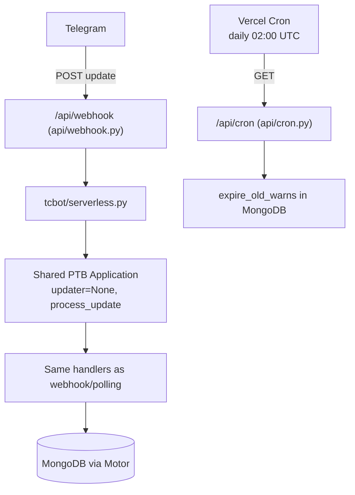

# Vercel Deployment

Native serverless deployment for TCF Bot on Vercel: Telegram delivers each
update to `/api/webhook`, and Vercel Cron drives warn expiry through
`/api/cron`. No polling process, no Flask server, no APScheduler.

For the project overview, see [`../../README.md`](../../README.md). For
environment variables, see [`../../config.env.example`](../../config.env.example).
For the database layer, see [`../architecture/database.md`](../architecture/database.md).

## Ownership

| Concern | Owner |
|---|---|
| HTTP plumbing (routes, status codes) | `api/webhook.py`, `api/cron.py` |
| Serverless PTB lifecycle (app build, init, update dispatch, expiry) | `tcbot/serverless.py` |
| Handler wiring (shared with webhook/polling transports) | `tcbot/__main__._register_handlers` |
| Schedules, timeouts | `vercel.json` |
| Dependency install | `pyproject.toml` + `uv.lock` (Vercel installs from these; no `requirements.txt`) |
| Python version | `.python-version` (`3.14`, matching the project target) |

## How it works



- Each Telegram update runs in its own invocation: `/api/webhook`
  validates `X-Telegram-Bot-Api-Secret-Token`, decodes the update, and calls
  `Application.process_update()` on a per-instance shared Application
  (built once per warm instance, reused across invocations on one
  process-wide event loop).
- Handler registration is the same `_register_handlers()` used by the
  long-lived transports, so command behaviour is identical.
- APScheduler never starts on Vercel. Warn expiry (`WARN_EXPIRY_DAYS > 0`)
  runs via the daily Vercel Cron job hitting `/api/cron`, which calls the
  same `expire_old_warns()` the scheduler uses. `member_cache` cleanup still
  runs through the MongoDB TTL index and needs nothing.
- `GET /api/webhook` returns `OK` as a liveness probe.

## Setup

### 1. Environment variables

Set these in the Vercel dashboard (Project → Settings → Environment Variables).
Never commit real values.

| Variable | Required on Vercel | Notes |
|---|---|---|
| `BOT_TOKEN` | Yes | Telegram bot token from BotFather. |
| `MONGODB_URI` | Yes | Reachable from Vercel (Atlas with network access for `0.0.0.0/0`, or equivalent). |
| `OWNER_ID` | Yes | Seeded as Founder on first init. |
| `WEBHOOK_SECRET` | **Yes** | Explicit secret for update validation. The endpoint fails closed (`503`) without it: the auto-generated startup token changes per cold start and can never match Telegram's copy. |
| `CRON_SECRET` | Yes (production) | Bearer token for `/api/cron`. Without it the endpoint is open. |
| `WEBHOOK_URL` | Build-time reference | Set to `https://<project>.vercel.app` so `set_webhook` (step 3) points at the deployment. Not read by the functions themselves. |
| `DB_NAME` | No | Default `tcbot`. |
| `REDIS_URL` | No | Recommended: without Redis, rate limiting and role caches are per-instance in-memory. Upstash Redis works. |
| `WARN_EXPIRY_DAYS` | No | `0` disables expiry; set `> 0` to let the daily cron prune warns. |
| `LOG_LEVEL` | No | Default `INFO`. |

All other federation variables (`MAIN_GROUP`, `LOGS`, `PROOFS`, `APPEALS`,
`WARN_LIMIT`, …) behave exactly as in long-lived mode.

### 2. Deploy

```bash
vercel --prod
```

Vercel installs dependencies from `pyproject.toml` + `uv.lock`, uses Python
`3.14` from `.python-version`, and creates two functions (`/api/webhook`
with `maxDuration: 60`, `/api/cron` with `maxDuration: 60` plus a daily
`02:00 UTC` schedule) per `vercel.json`.

### 3. Register the webhook (once per URL)

Serverless instances cannot call `set_webhook` at startup, so register it
manually. **Stop every other bot instance first** (two live transports for
one token cause `Conflict` polling/webhook fights):

```bash
curl -X POST "https://api.telegram.org/bot<BOT_TOKEN>/setWebhook" \
  -d "url=https://<project>.vercel.app/api/webhook" \
  -d "secret_token=<WEBHOOK_SECRET>" \
  -d "drop_pending_updates=true"
```

Verify with `getWebhookInfo` (URL must match exactly, pending count drains
to `0`). Re-run after every redeploy that changes the project URL.

### 4. Validate

- `GET https://<project>.vercel.app/api/webhook` → `200 OK`.
- Send `/checkme` in bot DM → profile reply arrives.
- `GET https://<project>.vercel.app/api/cron` with
  `Authorization: Bearer <CRON_SECRET>` → `200` with an expiry summary.
- Vercel dashboard → Functions logs show `serverless: subsystems ready.`
  on first cold start (MongoDB connect + index ensure + owner seed).

## Limitations (read before relying on Vercel mode)

- **Multi-step conversations are best-effort.** Ban proof collection,
  reason prompts, appeal DM flows, and promotion flows keep state in
  instance memory (no PTB persistence is configured). A cold start between
  steps loses the conversation. Stateless commands (`/check`, `/warns`,
  stats views, help) work reliably; proof-gated moderation should stay on
  a long-lived transport for production federations.
- **Timeouts and Telegram retries.** Federation fan-out across many groups
  can approach the function limit; `maxDuration: 60` covers typical
  federations on paid plans (Hobby clamps lower — upgrade for 50+ groups).
  If Telegram times out waiting, it **retries the update**, which can
  double-apply non-idempotent actions (notably `/tcwarn` increments; ban
  re-issues dedupe via the update path).
- **Background tasks may not finish.** Fire-and-forget work (member-cache
  harvest, identity refresh, album debounce) can be frozen mid-flight when
  the invocation returns. Authoritative state (bans, warns, roles) is
  written synchronously inside handlers and is unaffected.
- **No persistent scheduler.** One-off timed unbans (`schedule_unban`)
  never fire on Vercel; only the daily warn-expiry cron runs.
- **Cron frequency.** Hobby projects allow one cron run per day (the
  default `0 2 * * *` complies); per-minute schedules need Pro/Enterprise.

## Troubleshooting

| Symptom | Likely cause | Fix |
|---|---|---|
| Every update → `503` | `WEBHOOK_SECRET` unset | Set explicit `WEBHOOK_SECRET`, redeploy, re-run `setWebhook` with it. |
| Every update → `403` | Secret mismatch | `secret_token` in `setWebhook` must equal `WEBHOOK_SECRET`. |
| First update slow, then fast | Cold start (Mongo connect + indexes) | Expected; warms after first invocation. |
| `Conflict` errors in logs | Another instance still running (Replit/polling) | Stop all other transports for this token. |
| Cron → `401` | Wrong/missing bearer | Send `Authorization: Bearer <CRON_SECRET>`; compare with project env. |
| Cron → `200` "disabled" | `WARN_EXPIRY_DAYS=0` | Set `> 0` to enable pruning. |
